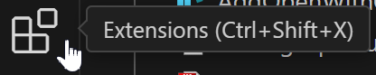

---

<div style="text-align:center;padding-top:100px;">
<a href="https://github.com/ZeroKlu">

</a>
</div>

<div style="text-align:center;font-size:16pt;padding-bottom:100px;">
Development Training - Workstation Setup Guide
</div>

---

<div style="page-break-after: always;"></div>

### Purpose:

Performing development requires a few components to be installed on your 
workstation. You can, of course, install whatever IDE you prefer, but I will 
be teaching the class using Visual Studio Code (the most popular IDE for 
development) and other convenience tools that you may find useful. If you want 
to set up your development environment similar to mine, the instructions below 
will walk you through the setup process. If you're following these steps, it 
is best to do them in the order presented.

If you are using one of my other development training setup guides, it is 
important to complete the setup in this guide first.

<div style="page-break-after: always;"></div>

### Table of Contents:

* [Configure Windows to Show File Extensions](#file-extensions)
* [Install Winget (App Installer)](#winget)
* [Install PowerShell 7](#pwsh)
* [Install Windows Terminal](#terminal)
* [Install the CaskaydiaCove Nerd Font](#font)
* [Customize the Windows Terminal](#c-term)
* [Set Up Oh-My-Posh](#posh)
* [Set Up Quake Mode Terminal (optional)](#quake)
* [Install Notepad++ (optional)](#notepad)
* [Install Visual Studio Code](#vscode)
* [Add Visual Studio Code Context Menu Options (optional)](#reg)
* [Customize Visual Studio Code](#custom)
* [Install GIT](#git)
* [Set Up a Source Control Account](#github)
* [Set Up Visual Studio Code to Use Source Control](#vsc-git)

<div style="page-break-after: always;"></div>

### <a id="file-extensions"></a>Configure Windows to Show File Extensions

When doing development, the convenience feature in Windows that hides the 
extensions for known file types is an impediment to the process, so let's turn 
that off.

1. Launch the Control Panel and go into the settings for
   "File Explorer Options."  
   

2. On the "View" tab, un-check the box labeled 
   "Hide extensions for known file types" Then click [OK]  
   

<div style="page-break-after: always;"></div>

### <a id="winget"></a>Install WinGet (App Installer)

Many of the components we will use are best installed from the terminal using 
a command-line installer like WinGet.

You can use any installation manager you prefer (like Chocolatey, e.g.), but I 
will be using WinGet. Follow the steps below to install it.

Note: On Windows 11, WinGet is already installed, but will need to be updated. 
Follow the same steps but substitute `Update` for `Get` in step 2.

1. Open the Microsoft Store and search for "App Installer"

2. Select the one created by "Microsoft Corporation" and click the [Get]
   button.  
   

3. The application will install automatically.

<div style="page-break-after: always;"></div>

### <a id="pwsh"></a>Install PowerShell 7

Although the built-in Windows PowerShell application is sufficient for most 
activities, the newer, open-source PowerShell 7 is significantly more 
customizable and provides more robust functionality when used in both Windows 
Terminal and Visual Studio Code.

1. Launch Windows PowerShell and enter the following command:  
   `winget install Microsoft.PowerShell`  
   

2. The installation will begin automatically. During the install, UAC will 
   prompt you to allow the app to make changes. Choose [Yes]  
   

3. After completion, you will see this message  
   

4. Close Windows PowerShell

5. Run `pwsh` to verify that you can now launch PowerShell 7  
   

<div style="page-break-after: always;"></div>

### <a id="terminal"></a>Install Windows Terminal

The Windows Terminal application allows you to have multiple terminal tabs 
open simultaneously and to control which of the command-line applications is 
in use at any time.

1. Open PowerShell 7 and enter the following command for Windows 10  
   `winget install Microsoft.WindowsTerminal`  

     

   or the following command for Windows 11 (where the Terminal application is 
   preinstalled)  
   `winget upgrade Microsoft.WindowsTerminal`  

2. Agree to the terms   
   

3. The installation will complete automatically  
   

4. Close PowerShell 7

5. Run `wt` to verify that you can open Windows Terminal  

<div style="page-break-after: always;"></div>

### <a id="font"></a>Install the CaskaydiaCove Nerd Font

We will be customizing our terminal to show additional information that will 
require glyph characters not included in most standard fonts. In order to 
support this, we'll be installing a so-called "nerd font" that includes these 
extra glyphs. The one I prefer is called CaskaydiaCove, which is a nerd-font 
port of Microsoft's Cascadia Code font. There are many different distributions 
of this font, and some don't include all of the glyphs, so I recommend 
obtaining the one distributed on the Nerd Fonts website (below).

1. Launch a browser and navigate to: [http://www.nerdfonts.com/font-downloads](http://www.nerdfonts.com/font-downloads)

2. Find "CaskaydiaCove Nerd Font" and click on "Download"  
   

3. Unzip and open the download file, select all of the fonts, right click,
   and select "Install for all users"  
   

4. The fonts will install to Windows automatically  
   

<div style="page-break-after: always;"></div>

### <a id="c-term"></a>Customize the Windows Terminal

To ready the Windows Terminal for our later setup, we need to configure a few 
preliminary settings.

> Note: You may have to reboot after installing your fonts before this step

1. Open the Windows Terminal and click on the drop-down arrow next to the tab 
   [+] button. Select "Settings"  
   

2. In the "Startup" section, set the "Default Profile" to "PowerShell"  
   

3. Under "Profiles" select "PowerShell" then scroll down and click on 
   "Appearance"  
   

4. In the "Font Face" setting, assign "CaskaydiaCove Nerd Font"  
   

5. Click [Save]

<div style="page-break-after: always;"></div>

### <a id="posh"></a>Set Up Oh-My-Posh

It's often useful to see additional information ( execution time, repository 
state, etc.) in the terminal. We can set up PowerShell 7 in Windows Terminal
to provide info using a utility called "Oh My Posh."

1. Open Windows Terminal and in your PowerShell 7 tab, enter the following 
   command:  
   `winget install JanDeDobbeleer.OhMyPosh`  
   

2. A successful install will look like this:  
   

3. In the terminal, enter the following line to create a setup file for your 
   PowerShell profile:  
   `New-Item -Path $PROFILE -Type File -Force`  
   

4. In the terminal, enter the following command to open the file in notepad:  
   `notepad $PROFILE`  
   

5. In the Notepad file, add the following line and save the file:  
   `oh-my-posh init pwsh | Invoke-Expression`  
   

6. In the terminal, enter the following command to reload the profile:  
   `. $PROFILE`  
   > Note: You may need to close and reopen the terminal window or reboot to 
   > load the profile path.

7. You should now see a prompt like this in the terminal indicating that 
   you've configured Oh My Posh:  
     
   > Note: If you don't see the folder glyph, make sure you installed and 
   > configured your nerd font

8. You can configure literally thousands of options for what information the 
   terminal prompt will show, but for purposes of the Python training class, I 
   will use Jan DeDobbeleer's default. To implement this, add the following 
   line to the profile setup in Notepad and save:  
   ```
   oh-my-posh init pwsh --config
   "$env:POSH_THEMES_PATH/jandedobbeleer.omp.json" | Invoke-Expression 
   $env:VIRTUAL_ENV_DISABLE_PROMPT = 1
   ```
   

9. In the terminal, enter the following command to reload the profile:  
   `. $PROFILE`

10. Edit the JSON file (path below) for the theme in any test editor (I used 
    Notepad++):  
    `C:\Users\USERNAME\AppData\Local\Programs\oh-my-posh\themes\jandedobbeleer.omp.json`

11. Find the python section.  
    From CTRL-F, search for \ue235, the Python powerline glyph  
   

12. Edit this section so that it reads as follows:
    ```json
    {
        "background": "#FFDE57",
        "foreground": "#111111",
        "powerline_symbol": "\ue0b0",
        "properties": {
            "display_mode": "files",
            "fetch_virtual_env": true,
            "folder_name_fallback": false
        },
        "style": "powerline",
        "template": " \ue235 {{ if .Error }}{{ .Error }}{{ else }}{{ if .Venv }}({{ .Venv }}) {{ end }}{{ .Full }}{{ end }} ",
        "type": "python"
    },
    ```

13. Now, you should see something like this:  
     
   This is how we want our prompt to appear in Visual Studio Code, so we're 
   done setting up the terminal.

<div style="page-break-after: always;"></div>

### <a id="quake"></a>Set Up Quake Mode Terminal (optional)

I like to have the terminal available at all times.

There is a special command to launch the Windows terminal in so-called 
"Quake-Mode."

When in this mode, the terminal is at the top of the main monitor screen and can be hidden or shown using the keyboard shortcut window+back-tick ```⊞+` ``` 

1. Click the start button and type "run" to open a run command. In the run 
   box, enter the following command and click [OK]  
   `shell:startup`  

   

2. In the window that pops up, right click and choose New > Shortcut.
   In the shortcut wizard, enter the following location and click [Next]  
   `wt -w _quake`  

   

3. Name the shortcut whatever you want and click [Finish]  
   

4. Now every time you reboot, you'll have a hideable PowerShell terminal at 
   the top of the screen  
   

<div style="page-break-after: always;"></div>

### <a id="notepad"></a>Install Notepad++ (optional)

Even though we're using Visual Studio Code as our IDE, it's often useful to 
have a full-featured text editor as well. I like to use Notepad++ for this.

1. In the terminal, enter the following command  
   `winget install Notepad++.Notepad++`  

   

2. Respond "Yes" to the UAC warning  
   

3. The installation will complete automatically  
   

4. Verify that you can now launch Notepad++  
   

<div style="page-break-after: always;"></div>

### <a id="vscode"></a>Install Visual Studio Code

Visual Studio Code is an open-source IDE that's useful for a wide variety of 
coding languages. I use it for Python, HTML, JavaScript, and CSS, even though 
I have Visual Studio Enterprise available for .NET development.

The slick, easy, and highly customizable interface make VS code the most popular IDE for Python developers.

1. In the terminal, enter the following command;  
   `winget install Microsoft.VisualStudioCode`  

   

2. The installation will start and complete automatically  
     
   

3. Create a folder called "VSCode Projects."" I created mine on the C: root.  
   

4. In the terminal, navigate to the folder you created and enter the
   following command:  
   `code .`  

     

   > Note: You may have to reboot to update your system paths before this 
   > command will work.

5. Visual Studio Code will automatically launch in your project folder.  
   

6. You can choose "Yes, I trust the authors" to allow VS Code to trust your 
   project folder going forward.  
   

<div style="page-break-after: always;"></div>

### <a id="reg"></a>Add Visual Studio Code Context Menu Options (optional)

Some developers find it useful to have the option to get to VS Code using the 
mouse instead of the terminal. Because we installed VS Code using WinGet, this 
option is not enabled during the install, and it is not available as a setting 
from within the application, because it requires editing the registry.

If you want to add the "Open with VS Code" option to the right click context
menu, do the following:

1. Create a text file anywhere on your PC and call it "AddOpenWithCode.reg"  
   Note: [An example is included here](./AddOpenWithCode.reg)  
   [](./AddOpenWithCode.reg)

2. Edit the file in your preferred text editor and paste the text below. Make 
   sure to replace all instances of "user_name" with your Windows username. 
   Then save the file.  
   ```pwsh
   Windows Registry Editor Version 5.00
    ; ***** Note: You must replace all instances of user_name with your username *****
    ;
    ; Open files
    [HKEY_CLASSES_ROOT\*\shell\VSCode]
    @="Open w&ith VS Code"
    "Icon"="C:\\Users\\user_name\\AppData\\Local\\Programs\\Microsoft VS Code\\Code.exe,0"
    [HKEY_CLASSES_ROOT\*\shell\VSCode\command]
    @="\"C:\\Users\\user_name\\AppData\\Local\\Programs\\Microsoft VS Code\\Code.exe\" \"%1\""
    ;
    ; This will make it appear when you right click ON a folder
    ; The "Icon" line can be removed if you don't want the icon to appear
    [HKEY_CLASSES_ROOT\Directory\shell\VSCode]
    @="Open w&ith VS Code"
    "Icon"="\"C:\\Users\\user_name\\AppData\\Local\\Programs\\Microsoft VS Code\\Code.exe\",0"
    [HKEY_CLASSES_ROOT\Directory\shell\VSCode\command]
    @="\"C:\\Users\\user_name\\AppData\\Local\\Programs\\Microsoft VS Code\\Code.exe\" \"%1\""
    ;
    ; This will make it appear when you right click INSIDE a folder
    ; The "Icon" line can be removed if you don't want the icon to appear
    [HKEY_CLASSES_ROOT\Directory\Background\shell\VSCode]
    @="Open w&ith VS Code"
    "Icon"="\"C:\\Users\\user_name\\AppData\\Local\\Programs\\Microsoft VS Code\\Code.exe\",0"
    [HKEY_CLASSES_ROOT\Directory\Background\shell\VSCode\command]
    @="\"C:\\Users\\user_name\\AppData\\Local\\Programs\\Microsoft VS Code\\Code.exe\" \"%V\""
   ```

3. Run the registry script **as administrator**, and choose the "Yes" option
   when prompted.  
   

4. Once the script has run, you will now have the new option "Open with VS
   Code" when you right-click on a folder or code file.  
   

<div style="page-break-after: always;"></div>

### <a id="custom"></a>Customize Visual Studio Code

Now, we need to set up VS Code and install a few add-ons before we're ready to 
start coding.

1. On initial launch, you are prompted to select a color theme. I usually 
   select "Dark Modern."  
   

2. If you installed Oh My Posh, you'll want it to work in VS Code just like it 
   does in Windows Terminal. To do this, press `[CTRL]+[SHIFT]+[P]` to bring 
   up the menu. Search for "json" and select the options titled "Preferences: 
   Open User Settings (JSON)"  
   

3. In the JSON file, add the following lines ***before*** the last closing 
   curly-brace:  
   ```json
   ,
   "terminal.integrated.profiles.windows": {
     "PowerShell": {
       "path": "C:\\Program Files\\PowerShell\\7\\pwsh.exe",
       "args": [
         "-noexit"
       ]
     }
   },
   "terminal.integrated.defaultProfile.windows": "PowerShell",
   "terminal.integrated.fontFamily": "'CaskaydiaCove Nerd Font', monospace",
   "terminal.integrated.fontSize": 14
   ```

4. Save the JSON file and click on Terminal > New Terminal. Your VS Code 
   terminal should launch with the same settings you implemented for Windows 
   Terminal.  
   

5. Click on the "settings" cog (at the lower left) and select "Settings"  
   

6. Search for "auto save" and change the "Files: Auto Save" setting to 
   "afterDelay"  
   This ensures that your file changes save as you type and makes 
   the process of updating and testing your code much quicker  
   

7. Click on the "Extensions" icon  
   

8. Search for "vscode icons" and install the extension  
   

9. After it installs, you'll be prompted to select a theme. Select the default 
   "VSCode Icons"  
   

<div style="page-break-after: always;"></div>

### <a id="git"></a>Install GIT

GIT is the underlying technology used to communicate with code repositories in
Bitbucket and GitHub, so we'll need to install and configure it.

1. In your terminal, enter the following command  
   `winget install Git.Git`  

   

2. Select "Yes" at the UAC prompt  
   

3. After successful installation, you'll see this:  
   

4. From a terminal, run the following commands to configure your default git 
   settings:  
   `git config --global user.email "your_git_email"`  
     
   `git config --global user.name "your_git_name"`  
   

<div style="page-break-after: always;"></div>

### <a id="github"></a>Set Up a Source Control Account

#### Option 1: Bitbucket

If you're one of my employees, the development team uses Bitbucket as our 
source control system for code sharing.

If not, skip to [Option 2: GitHub](#gh-2).

Since I share out development training repositories in the class, you'll need 
a Bitbucket account.

Note: If you already have a Bitbucket account, skip to the [Set Up Visual 
Studio Code to Use Source Control](#vsc-git) section

1. In a browser, navigate to [https://bitbucket.org](https://bitbucket.org) 
   and click on the [Get it free] button.  
   

2. Click [Next]  
   

3. Enter your work email address and click on [Sign up]  
   

4. Check your email for a verification message. In the message, click
   [Verify your email]  
   

5. On the page that pops up, enter your full name and create a password  
   

6. On the next screen, create a Bitbucket username  
   

7. When you reach the survey page, just click on "Skip"  
   

#### <a id="gh-2"></a>Option 2: GitHub

I have replicated my training repositories on GitHub. If you are not one of my 
employees and/or are not taking OnBase development training, you may find 
GitHub easier to access from VS Code, since GitHub functionality is built-in.

1. In your browser, go to [https://github.com](https://github.com)

2. Click the [Sign Up] button  
   

3. Enter your email, a password, and a username  
   

4. You can ignore the option to receive email announcements  
   

5. Click on the [Verify] button to access a puzzle that must be solved to 
   complete your enrollment  
   

6. Solve the puzzle and click [Submit]  
   

7. Enter the code sent to verify your email address  
   

8. You will be presented with your dashboard page, indicating that you 
   successfully set up your GitHub account.  
   

<div style="page-break-after: always;"></div>

### <a id="vsc-git"></a>Set Up Visual Studio Code to Use Source Control

#### Option 1: Bitbucket

If you chose Bitbucket for source control, you'll need to configure the 
Bitbucket extension in VS Code in order to properly access the training 
repository.

If you chose GitHub, skip to [Option 2: GitHub](#sc-gh)

1. Launch Visual Studio Code

2. Click on the "Extensions" icon on the left nav-bar  
   

3. Search for "bitbucket" and install the "Jira and Bitbucket" extension  
   

4. After the extension installs, it will launch a setup wizard. Unselect Jira 
   and click [Next]  
   

5. Select the option for "Bitbucket Cloud"  
   

6. You may receive a firewall alert. If you do, click on [Allow Access]  
   

7. You'll be prompted to let VS Code access the Bitbucket URL. Click [Open]  
   

8. Log in  
   

9. Click [Grant Access]  
   

10. You'll see a success page. You can close the browser after this comes up  
    

#### <a id="sc-gh"></a>Option 2: GitHub

For GitHub, VS Code credential setup takes place the first time you attempt to 
access a repository. To do this, take the following steps:

1. In VS Code, click on the Source Control icon  
   

2. Click the button labeled [Clone Repository]  
   

3. Select the option to "Clone from GitHub"  
   

4. Select "Allow" when prompted to allow the GitHub extension to attempt to 
   log in  
   

5. Choose the "Authorize" button  
   

6. Optionally check the "Always allow…" box, then select "Open"  
   

7. You should now see any available repositories from GitHub to which you have 
   access  
   

<div style="page-break-after: always;"></div>

---

<div style="text-align:center;font-size:16pt;padding-top:100px;padding-bottom:100px;">
    <p>Congratulations! Your system is set up for development training.</p>
    <p>Happy Coding!</p>
</div>

---
