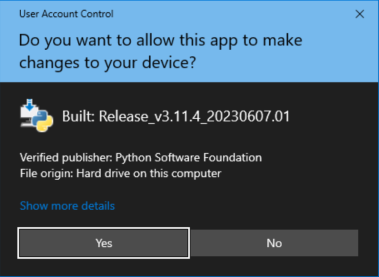
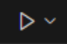

---

<div style="text-align:center;padding-top:100px;">
<a href="https://github.com/ZeroKlu">

</a>
</div>

<div style="text-align:center;font-size:16pt;padding-bottom:100px;">
Python Training - Workstation Setup Guide
</div>

---

<div style="page-break-after: always;"></div>

### Purpose:

Performing Python development requires a few components to be installed on 
your workstation. You can, of course, install whatever IDE you prefer, but I 
will be teaching the class using Visual Studio Code (the most popular IDE for 
Python development) and other convenience tools that you may find useful.

If you want to set up your development environment similar to mine, the 
instructions below will walk you through the setup process. If you're 
following these steps, it is best to do them in the order presented.

<div style="page-break-after: always;"></div>

### Table of Contents:

* [Prerequisites](#prereq)
* [Install Python](#python)
* [Customize Visual Studio Code](#vsc)
* [Create a Test Project in Python](#project)
* [Clone the Python Training Repository](#clone)
* [Import Snippets (optional)](#snippets)

<div style="page-break-after: always;"></div>

### <a id="prereq"></a>Prerequisites

Prior to any of the steps listed below, please complete all tasks in the guide 
titled:

[01 Setting Up Your Workstation for Development Training.pdf](./01%20Setting%20Up%20Your%20Workstation%20for%20Development%20Training.pdf)

<div style="page-break-after: always;"></div>

### <a id="python"></a>Install Python

Before we can write and execute Python, we need to install the Python 
interpreter itself. The current version of Python at the time of writing this 
document is v3.11. This version is compatible with the code examples we'll use 
in the course.

1. In the terminal, enter the following command  
   `winget install Python.Python.3.11`  

   

2. Select [Yes] at the UAC prompt  
   

3. The installer will run and complete automatically  
     
   

4. To verify that you have Python installed, enter the following in the 
   terminal:  
   `python --version`  
   
     

   > Note: You may need to reboot before this command will work

<div style="page-break-after: always;"></div>

### <a id="vsc"></a>Customize Visual Studio Code

We need to set up VS Code and install a few add-ons before we're ready to 
start coding.

1. Click on the "Extensions" icon on the left nav-bar  
   

2. Search for "python" and install the Python extension  
   

3. This also installs the Pylance component. You can install other add-ons if 
   desired, but those are the only ones we need to get started with Python 
   coding.  
   

<div style="page-break-after: always;"></div>

### <a id="project"></a>Create a Test Project in Python

Just to validate that we have all our components installed, we'll create a
test project and verify that Python is working.

1. Create a folder Named "Python" and in it, create a subfolder called 
   "hello-world"  
   

2. Navigate to the folder and open it in VS Code  
   

3. Click on the "new file" icon in the explorer tab in VS Code  
   

4. Title your file "hello_world.py"  
   

5. Enter the following code  
   ```python
   print("Hello World!")
   ```
   

6. Press `[CTRL]+[SHIFT]+[P]` to bring up the options menu. Search for 
   "interpreter" and choose "Python: Select Interpreter"  
   

7. Choose the version of Python you installed earlier in this process  
   

8. Click the "Run" icon on the top toolbar  
   

9. The terminal will launch and run your program. You will see "Hello World!"" 
   in the terminal  
   

<div style="page-break-after: always;"></div>

### <a id="clone"></a>Clone the Python Training Repository

Finally, you'll need to clone a copy of the repository to work with.

I have two different locations where this repository is stored:

* Bitbucket (for my internal employees):  
  [https://bitbucket.org/databankimx/python-training](https://bitbucket.org/databankimx/python-training)
* GitHub (accessible to everyone):  
  [https://github.com/ZeroKlu/python-crash-course](https://github.com/ZeroKlu/python-crash-course)

1. For access to either repository, please email me at
   [zeroklu@protonmail.com](mailto:zeroklu@protonmail.com?subject=Request%20Access%20to%20Python%20Training%20Repository)

   Be sure to indicate whether you need access to Bitbucket or GitHub and 
   provide the username you use on the selected source control system.

2. After I respond granting your access, navigate in your browser to the 
   repository you selected and make sure you have access.  

    * In Bitbucket, you should see this:  
      

    * In GitHub, you should see this:  
      

3. Right-click the VS Code icon and select "New Window" to open an empty VS 
   Code instance.  
   

4. Click the Source Control icon on the sidebar  
   

5. Click the button labeled [Clone Repository]  
   

6. Enter the URL to the repository you selected  
   

7. Select a local path for the parent folder where the repository will be
   copied  
   

8. The repository will be copied locally to the path you selected  
   

9. If you are using GitHub, skip to [step 11](#clone11)

10. If you're using Bitbucket, you'll be prompted to log in again.  
    Grant access again in the web page that opens  
    

11. <a id="clone11"></a>When asked if you want to open the repository, click 
    [Open]  
    

12. The repository will open, and you should see a number of folders 
    containing sample code from the textbook (with samples and commentary from 
    me).  
    

<div style="page-break-after: always;"></div>

### <a id="snippets"></a>Import Snippets (optional)

Visual Studio Code includes a built-in system that allows you to save snippets
(small pieces of frequently-used code) for each of its many supported 
languages.

I have included a file for Python
([python.json](../Snippets/python.json)) in the repository containing this 
snippet, that you can add to VS Code if you wish:

```json
{
    "Basic Script Template": {
        "prefix": "&template",
        "body": [
            "def my_function(*args: any, **kwargs: any) -> None:",
            "    \"\"\"Doc string for function\"\"\"",
            "    pass",
            "",
            "def main() -> None:",
            "    \"\"\"Main process\"\"\"",
            "    my_function()",
            "",
            "if __name__ == \"__main__\":",
            "    main()",
            ""
        ],
        "description": "Basic Script Template"
    }
}

```

1. In VS Code, under the "File" menu, click on "Preferences" > "Configure User 
   Snippets"  
   

2. From the languages list, select "python"  
   

3. This will open a snippets file called "python.json"  
   

4. Copy the JSON provided above into the snippet file, then save the file.  
   

5. In any Python (*.py) file, you can now start typing "&template" and the 
   snippet will be available.  
   

6. Once you select the snippet, the following template code will be added to 
   your file automatically:  
   ```python
   def my_function(*args: any, **kwargs: any) -> None:
       """Doc string for function"""
       pass
   
   def main() -> None:
       """Main process"""
       my_function()
   
   if __name__ == "__main__":
       main()
   ```

<div style="page-break-after: always;"></div>

---

<div style="text-align:center;font-size:16pt;padding-top:100px;padding-bottom:100px;">
    <p>Congratulations! Your system is set up for Python training.</p>
    <p>Happy Coding!</p>
</div>

---


