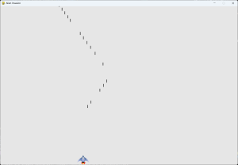

## Shooting Bullets

The ship isn't really useful until you can shoot at the aliens. Let's
add some functionality to make it do so.

---

### Bullet Settings

First, we'll add some settings for the bullet.

```python
    def __init__(self):
        # -- SNIP --

        # Bullet settings
        self.bullet_speed = 2.0
        self.bullet_width = 3
        self.bullet_height = 15
        self.bullet_color = (60, 60, 60)
```

---

### The Bullet Class

Next, we'll create a `Bullet` class to define the bullet's properties.

```python
class Bullet(Sprite):
    """A class to manage bullets fired from the ship."""

    def __init__(self, ai_game):
        """Create a bullet object at the ship's current position."""
        super().__init__()
        self.screen = ai_game.screen
        self.settings = ai_game.settings
        self.color = self.settings.bullet_color

        # Create a bullet rect at (0, 0) and then set correct position.
        self.rect = pygame.Rect(0, 0, self.settings.bullet_width,
                                self.settings.bullet_height)
        self.rect.midtop = ai_game.ship.rect.midtop

        # Store the bullet's position as a float.
        self.y = float(self.rect.y)
```

---

### Moving the Bullet

Now we can add functionality to update the bullet's position and draw 
it on the screen.

```python
    def update(self, *args, **kwargs):
        """Move the bullet up the screen."""
        # Update the exact position of the bullet.
        self.y -= self.settings.bullet_speed
        # Update the rect position.
        self.rect.y = self.y

    def draw_bullet(self):
        """Draw the bullet to the screen."""
        pygame.draw.rect(self.screen, self.color, self.rect)
```

Note: It is not necessary to add the `*args` and `**kwargs` arguments
to the `update` method, and the book does not do so. However, when
we are inheriting from the `Sprite` class, we are technically overriding
an existing method with the following signature:

```python
def update(self, *args, **kwargs):
    ...
```

It is a best practice to make sure a child class override presents the 
same signature as the base class method.

---

### Creating a Group of Bullets

Now that we have a `Bullet` class, we can create a group to store the
currently fired bullets.

For this, we'll update the `AlienInvasion` `__init__` method to create
the `bullets` group.

```python
    def __init__(self):
        # -- SNIP --
        self.bullets = pygame.sprite.Group()
```

Then we'll add a call to the `update` method on the group.

```python
    def run_game(self):
        # -- SNIP --
        while True:
            # -- SNIP --
            self.bullets.update()
```

The `update` method on a sprite `Group` will call the `update` method
on each sprite in the group.

---

### Firing Bullets

```python
    def _check_keydown_events(self, event):
        # -- SNIP --
        elif event.key == pygame.K_SPACE:
            self._fire_bullet()

    def _fire_bullet(self):
        """Create a new bullet and add it to the bullets group."""
        new_bullet = Bullet(self)
        self.bullets.add(new_bullet)

    def _update_screen(self):
        # -- SNIP --
        for bullet in self.bullets.sprites():
            bullet.draw_bullet()
        # -- SNIP --
        pygame.display.flip()
```

---

### Deleting Used Bullets

Currently, the bullets are not removed from the group when they leave
the screen. Let's fix that.

```python
    def run_game(self):
        # -- SNIP --
        while True:
            # -- SNIP --
            self.bullets.update()
            # Get rid of bullets that have disappeared.
            for bullet in self.bullets.copy():
                if bullet.rect.bottom <= 0:
                    self.bullets.remove(bullet)
```

---

### Checking Our Work

Now, when we run the game, pressing the spacebar should add a bullet.



---

### Limiting the Number of Bullets

We can limit the number of bullets that can be on the screen at any
given time. Let's add a `max_bullets` attribute to the `Settings`
class.

```python
    def __init__(self):
        # -- SNIP --
        self.max_bullets = 3
```

Then we can implement that maximum number of bullets in the 
`_fire_bullet` method.

```python
    def _fire_bullet(self):
        """Create a new bullet and add it to the bullets group."""
        if len(self.bullets) < self.settings.bullets_allowed:
            new_bullet = Bullet(self)
            self.bullets.add(new_bullet)
```

---

### Refactoring

Let's do a quick refactor, since the bullet behavior is now
complicating the `run_game` method.

```python
    def _update_bullets(self):
        """Update position of bullets and get rid of old bullets."""
        # Update bullet positions.
        self.bullets.update()
        for bullet in self.bullets.copy():
            if bullet.rect.bottom <= 0:
                self.bullets.remove(bullet)

    def run_game(self):
        # -- SNIP --
        while True:
            # -- SNIP --
            self._update_bullets()
```
