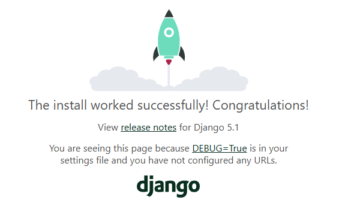

## Project Setup

Let's create the Django project we'll be using in this chapter.

### Virtual Environments

A virtual environment is a directory that contains a copy of Python 
and all of the modules installed in that environment.

The advantage of a virtual environment is that it allows you to 
install a project's dependencies in a way that is isolated from other 
projects.

You can find instructions for creating a virtual environment in:  
[Chapter 8 - Bonus Lesson: Virtual Environments](../../../../../Part%20I%20-%20Basics/Ch08_Functions/Lessons/12_bonus_virtual_environments.md)

The book recommends creating a virtual environment called `ll_env`.

To keep mine sorted out of the way, I will follow the pattern of 
preceding the virtual environment name with a period (`.ll_env`).

```powershell
py -m venv .ll_env
.ll_env\Scripts\activate
```

Don't forget to upgrade PIP in your venv:  
```powershell
python -m pip install --upgrade pip
```

---

### Installing Django

To install Django, you can use the following command:  
```powershell
python -m  pip install django
```

---

### Creating a Django Project

To create a Django project, first create a directory called
`learning_log`. Then navigate to that directory and use the following 
command:

```powershell
django-admin startproject ll_project .
```

This will create a Django project in the `learning_log` directory
containing the following files:

```
─ learning_log
 ├─ manage.py
 └─ ll_project
  ├─ __init__.py
  ├─ asgi.py
  ├─ settings.py
  ├─ urls.py
  └─ wsgi.py
```

These files perform the following tasks:

* manage.py - reads commands and passes them to Django
* ll_project - contains the Django project
* settings.py - tells Django how to interact with your system
* urls.py - tells Django what pages to build in response to browser 
  requests
* wsgi.py - web server gateway interface (helps serve created web 
  pages)

---

### Creating the Project Database

To create the project database, navigate to the `learning_log` 
directory and use the following command:

```powershell
python manage.py migrate
```

This command is used every time we make modifications to the
database. When it is run without a database in place, it creates the 
empty database file.

Expected Output:

```
Operations to perform:
  Apply all migrations: admin, auth, contenttypes, sessions
Running migrations:
  Applying contenttypes.0001_initial... OK
  Applying auth.0001_initial... OK
  Applying admin.0001_initial... OK
  Applying admin.0002_logentry_remove_auto_add... OK
  Applying admin.0003_logentry_add_action_flag_choices... OK
  Applying contenttypes.0002_remove_content_type_name... OK
  Applying auth.0002_alter_permission_name_max_length... OK
  Applying auth.0003_alter_user_email_max_length... OK
  Applying auth.0004_alter_user_username_opts... OK
  Applying auth.0005_alter_user_last_login_null... OK
  Applying auth.0006_require_contenttypes_0002... OK
  Applying auth.0007_alter_validators_add_error_messages... OK
  Applying auth.0008_alter_user_username_max_length... OK
  Applying auth.0009_alter_user_last_name_max_length... OK
  Applying auth.0010_alter_group_name_max_length... OK
  Applying auth.0011_update_proxy_permissions... OK
  Applying auth.0012_alter_user_first_name_max_length... OK
  Applying sessions.0001_initial... OK
```

The project now contains a database file: `db.sqlite3`.

---

### Test the Project Setup

To test the project setup, navigate to the `learning_log` directory
and use the following command:

```powershell
python manage.py runserver
```

> Note: If port 8000 is already in use, you will get an error.
> In that case, you will need to specify a different port as follows:
> ```powershell
> python manage.py runserver 8001
> ```
> Replace port 8000 below with the one you choose.

Output:

```
Watching for file changes with StatReloader
Performing system checks...

System check identified no issues (0 silenced).
January 20, 2025 - 07:27:44
Django version 5.1.5, using settings 'll_project.settings'
Starting development server at http://127.0.0.1:8000/
Quit the server with CTRL-BREAK.
```

With the server running, you can now browse to
[http://127.0.0.1:8000](http://127.0.0.1:8000/) to see the project
in your web browser.

This results in the following being added to the console:

```
[20/Jan/2025 07:30:03] "GET / HTTP/1.1" 200 12068
Not Found: /favicon.ico
[20/Jan/2025 07:30:03] "GET /favicon.ico HTTP/1.1" 404 2212
```

Currently, with nothing in the database or configured for the site,
you will see the default Django home page:



To stop the server, press CTRL+C.

---
