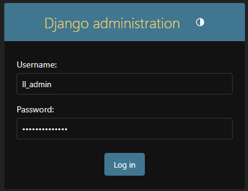
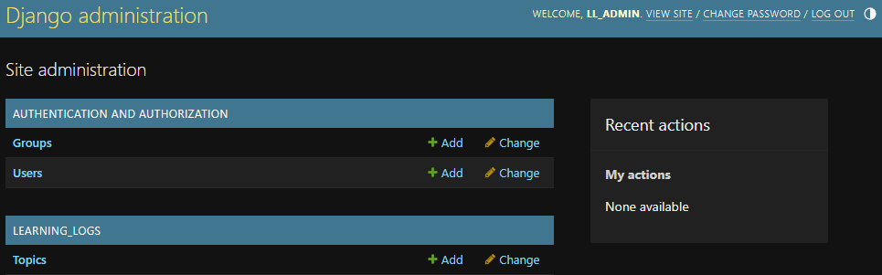
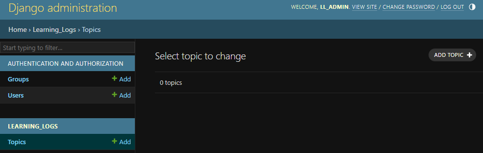
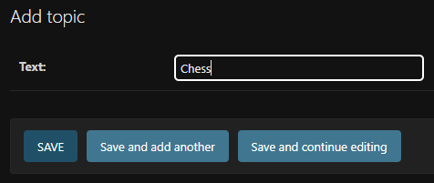
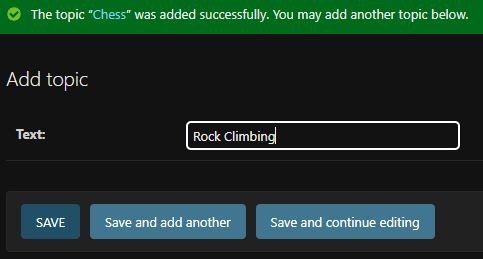
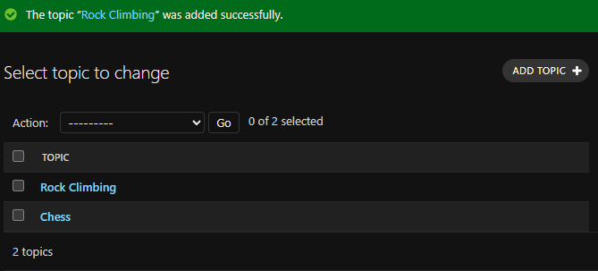

## Using the Django Admin Site

Now that we have a database with a model, we can use the Django admin
site to add some data.

Note: The Django admin site is only intended for use by administrators

---

### Creating a Superuser

Navigate to the `learning_log` directory and use the following command:

```powershell
python manage.py createsuperuser
```

Output:

```
Username (leave blank to use 'smclean'): ll_admin
Email address: 
Password: 
Password (again): 
Superuser created successfully.
```

You can name your superuser whatever you want, but the book uses
`ll_admin`.

Email address can be left blank.

Passwords must match and must be minimum 8 characters long.

---

### Register the Model

To make a model available in the Django admin site, it must be
registered in `admin.py`.

In `admin.py`...

```python
"""Defines the admin site for learning_logs."""

from django.contrib import admin

from .models import Topic

admin.site.register(Topic)
```

---

### Accessing the Admin Site

Navigate to:
[http://127.0.0.1:8000/admin/](http://127.0.0.1:8000/admin/)

\* Note: The port number may be different on your PC

You should encounter a login page like this where you can enter the 
credentials for the superuser account you created earlier.



\* Note: If you receive a 404 error, check to make sure one of your 
terminals is running the server and that there are no errors in the 
terminal

After logging in, you should see the following page (including the
`Topic` model):



---

### Adding Topics

So that we have some data to work with, let's add some topics.

From the admin page, click the `Topics` link. You should be presented
with the following page:



Click the `Add Topic` button.



Enter "Chess" in the "Text" field and click the 
`Save and add another` button.



Enter "Rock Climbing" in the "Text" field and click the 
`SAVE` button.

You should now see the following page including the two topics you 
just added:



---
