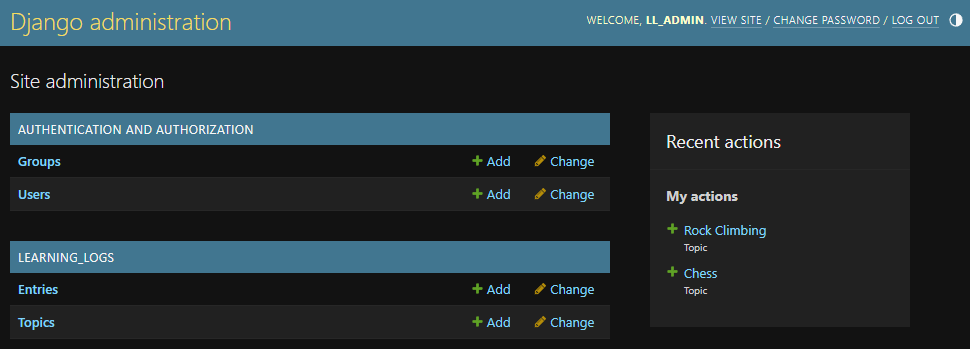
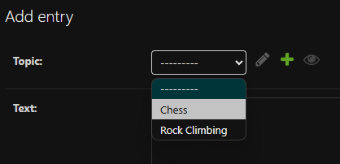
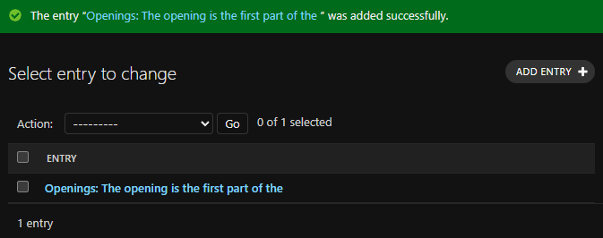

## Adding the `Entry` Model

Now that we've added a couple of topics to our portal, we need to have
a way to log events within them. For this we'll add an `Entry` model.

Items of the `Entry` type will have a many-to-one relationship with
the `Topic` model.

---

### Creating the `Entry` Model

We'll add the new class to our `models.py` file.

In `models.py`...

```python
-- SNIP --

class Entry(models.Model):
    """Something specific learned about a topic."""
    topic = models.ForeignKey(Topic, on_delete=models.CASCADE)
    text = models.TextField()
    date_added = models.DateTimeField(auto_now_add=True)

    class Meta:
        """Model management options."""
        verbose_name_plural = 'entries'

    def __str__(self):
        """Return a string representation of the model."""
        return str(self.text)[:50]
```

Here, we have two similar attributes to those we used on the `Topic`
model. The `text` attribute is a `TextField` and `date_added` is a
`DateTimeField`.

However, we've added a new attribute, `topic`. This is a
`ForeignKey`, pointing to the `Topic` model. This ties the `Entry` to
the automatically generated key for an instance of the `Topic` model.

Setting the `on_delete` attribute to `CASCADE` means that if a `Topic`
is deleted, all of related its `Entry` instances will be deleted as 
well.

Adding the `Meta` class with the `verbose_name_plural` attribute
overrides the default plural of the `Entry` model to `entries`, where
it would have been `Entrys`.

---

### Migrating the `Entry` Model

As before, in order to update the database, we need to run the
following commands:

```powershell
python manage.py makemigrations learning_logs
```

Output:
```
Migrations for 'learning_logs':
  learning_logs\migrations\0002_entry.py
    + Create model Entry
```
---

```powershell
python manage.py migrate
```

Output:
```
Operations to perform:
  Apply all migrations: admin, auth, contenttypes, learning_logs, sessions
Running migrations:
  Applying learning_logs.0002_entry... OK
```

---

### Verifying the `Entry` Model

Once we register the `Entry` model...

In `admin.py`...
```python
-- SNIP --
from .models import Topic, Entry

admin.site.register(Topic)
admin.site.register(Entry)
```

... we can re-visit the [admin site](http://127.0.0.1:8000/admin)
and see the new model.



---

### Adding Entries

Now we can add an entry to our portal.

We can click the `+ Add` button beside "Entries" to add a new entry.

From the "Add entry" page, we'll select "Chess" from the drop-down
list.



And then enter some text in the "Text" field. The book provides the following:

> Openings:
> 
> The opening is the first part of the game, roughly the first ten 
> moves or so. In the opening, it's a good idea to do three 
> things--bring out your bishops and knights, try to control the 
> center  of the board, and castle your king.
> 
> Of course, these are just guidelines. It will be important to learn 
> when to follow these guidelines and when to disregard these 
> suggestions.

Click the "SAVE" button, and the entry will be added.



The book provides an additional entry for the "Chess" topic...

> Bishops and Knights:
> 
> In the opening phase of the game, it's important to bring out your 
> bishops and knights. These pieces are powerful and maneuverable 
> enough to play a significant role in the beginning moves of a game.

... and one for the "Rock Climbing" topic...

> Using Your Legs:
> 
> One of the most important concepts in climbing is to keep your 
> weight  on your feet as much as possible. There's a myth that 
> climbers can  hang all day on their arms. In reality, good climbers 
> have practiced  specific ways of keeping their weight over their 
> feet whenever  possible.

Go ahead and add both.

---
