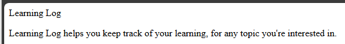

## Making the Home Page

> Note: When making a portal application, you can't escape the need
> to know at least the fundamentals of HTML and CSS. You can
> complete this tutorial without that experience, but continuing into
> designing your own portal wills require some HTML and CSS.

Creating user pages in a Django portal consists of three steps:

1. Defining the URL
2. Coding the View
3. Creating the Template

---

### Defining the Home Page URL

A URL pattern defines the location of a page in the web application. The URL pattern for the home page is `/` (slash).

We'll start by adding a URL pattern to the project-wide URLs file.

In `ll_project/urls.py`:

```python
"""URL configuration for ll_project project."""

from django.contrib import admin
from django.urls import path, include

urlpatterns = [
    path("admin/", admin.site.urls),
    path("", include("learning_logs.urls")),
]
```

This tells the project to expect a file called `urls.py` in the |`learning_logs` application.

We'll need to create that file with the following contents:

In `learning_logs/urls.py`:

```python
"""Defines URL patterns for learning_logs app."""

from django.urls import path

from . import views

app_name = "learning_logs"

urlpatterns = [
    # Home page
    path("", views.index, name="index"),
]
```

Note: If you are using a linter (like PyLint), you will see an error
at this point that "Module 'learning_logs.views' has no 'index' 
member". This is because we have not yet created the view to which 
the URL pattern points.

---

### Creating the Home Page View

A view prepares the data needed for the page it feeds.

Now we need to create the view for the home page.

In `learning_logs/views.py`:

```python
"""Views for learning_logs."""

from django.shortcuts import render

def index(request):
    """The home page for learning_logs."""
    return render(request, 'learning_logs/index.html')
```

This code will render the `index.html` template and return the page 
to the browser, including data from the associated model.

---

### Creating the Home Page Template

We need a place to store HTML templates. In `learning_logs`, we will
create a directory called `templates` containing another folder named `learning_logs`. In the inner folder, we will create a file called `index.html`.

In `index.html`...

```html
<p>Learning Log</p>
<p>
    Learning Log helps you keep track of your learning,
    for any topic you're interested in.
</p>
```

Note: This is not a complete HTML file, so you will see errors
reported if you're using an HTML linter.

---

### Verifying the Home Page

To verify that the home page works, open a browser and go to
[http://127.0.0.1:8000](http://127.0.0.1:8000/) or
[http://localhost:8000](http://localhost:8000/)

You should see the following page in the browser:



---
