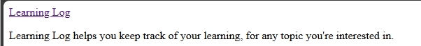

## Template Inheritance

Of course, a portal isn't very useful with just a single, 
non-interactive page. So, let's add some more pages.

---

### Creating a Base Template

In order to reduce redundancy and facilitate maintenance, we can 
create a base template that will be used for all of our pages.

In the same folder where we created the `index.html` template,
create a new file called `base.html` containing the following:

```html
<p>
    <a href="">Learning Log</a>
</p>


```

There are a couple of new concepts in this code:

* The syntax `` is a *template tag*.
    * This allows us to include information from the Django portal
      in the HTML code.
    * In this case, `` will return
      the URL for the `learning_logs:index` view.
    * The syntax `` is a
      placeholder block for the identified part of a page that 
      inherits the base template.

---

### Inheriting from the Base Template

Now that we have a base template, we can inherit from it in our other
templates.

Modify the `index.html` template to look like this:

```html



<p>
    Learning Log helps you keep track of your learning,
    for any topic you're interested in.
</p>

```

Here, we are inheriting from the `base.html` template using the `` tag.

And we're identifying the content of the page using the  
`` tags.

---

### Validating the Inheritance

To verify that the home page is inheriting the base template, open a 
browser and go to
[http://127.0.0.1:8000](http://127.0.0.1:8000/) or
[http://localhost:8000](http://localhost:8000/)

You should see the following page in the browser:



Notice that the first paragraph is now the hyperlink from the base 
template.

---
