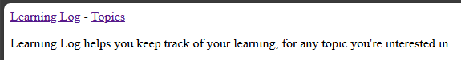
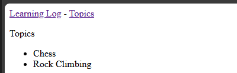

## The Topics Pages

Let's add a page to view a list of topics.

---

### Topics Page URL

As usual, we'll start by adding a URL pattern.

In `learning_logs/urls.py`:

```python
-- SNIP --

urlpatterns = [
    # Home page
    path("", views.index, name="index"),

    # Show all topics
    path("topics/", views.topics, name="topics"),
]
```

---

### Topics Page View

Now, we need to create the view used by the topic page.

In `learning_logs/views.py`:

```python
-- SNIP --

from .models import Topic

-- SNIP --

def topics(request):
    """Show all topics."""
    topic_list = Topic.objects.order_by("date_added")
    context = {"topics": topic_list}
    return render(request, "learning_logs/topics.html", context)
```

Here, we are executing a query (similar to how we examined data using
the Django shell) to get a list of all topics.

Next, we're creating a dictionary (called `context`) that contains the
data we received from our query.

Finally, we are rendering an html page called `topics.html` with the
context data.

---

### Topics Page Template

In `learning_logs/templates/learning_logs/topics.html`:

```html



<p>Topics</p>
<ul>
    
    <li>{{ topic.text }}</li>
    
    <li>No topics have been added yet.</li>
    
</ul>

```

---

### Linking to the Topics Page

We need to add a link to get to our new page.

In `learning_logs/templates/learning_logs/base.html`:

```html
<p>
    <a href="">Learning Log</a>
    - 
    <a href="">Topics</a>
</p>


```

---

### Validating the Topics Page

In your browser, again navigate to
[http://localhost:8000](http://localhost:8000) or
[http://127.0.0.1:8000](http://127.0.0.1:8000).

You should see a new link for "Topics" under "Learning Log".



Clicking on the new link should navigate to the topics page.



---
