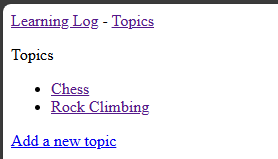
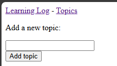
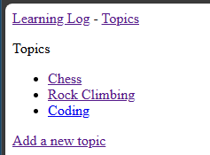

## Letting Users Enter Data

We'll eventually need to allow users to create new accounts. Before we
do that, however, we should create the functionality to allow them to
enter data (topics and entries) and edit the data they have previously
created.

---

### Creating a `Topic` ModelForm

In HTML, when we need to get information back from a user, we use a 
form. It's important that our form have the ability to validate the 
data (ensure it is of the proper type and sanitize it to avoid 
ingesting malicious data). If we were developing the portal 
completely from scratch, we would have to write code to perform that 
task. With Django, however, we can use a built-in *ModelForm* to do 
much of this work for us.

We'll create a new file called `forms.py` in the `learning_logs` 
directory and add the following code to it:

In `learning_logs/forms.py`...

```python
"""ModelForms for the learning_logs app."""

from django import forms
from .models import Topic

class TopicForm(forms.ModelForm):
    """Form for the Topic model."""

    class Meta:
        """Metadata for the TopicForm."""
        model = Topic
        fields = ["text"]
        labels = {"text": ""}
```

At a minimum, a ModelForm must contain a nested `Meta` class that 
specifies the model to use and the fields to include in the form.

---

### The New Topic URL

As with previous examples, we'll start by creating a URL to point to
the form for entering a new topic.

In `learning_logs/urls.py`...

```python
-- SNIP --

urlpatterns = [
    -- SNIP --

    # Page for adding a new Topic
    path("new_topic/", views.new_topic, name="new_topic"),
]
```

---

### The New Topic View

Of course, this URL requires a view, so...

In `learning_logs/views.py`...

```python
from django.shortcuts import render, redirect

-- SNIP --

from .forms import TopicForm

-- SNIP --

def new_topic(request):
    """Add a new topic."""
    if request.method != "POST":
        # No data submitted; create a blank form.
        form = TopicForm()
    else:
        # POST data submitted; process data.
        form = TopicForm(data=request.POST)
        if form.is_valid():
            form.save()
            return redirect("learning_logs:topics")

    # Display a blank or invalid form.
    context = {"form": form}
    return render(request, "learning_logs/new_topic.html", context)
```

We have several new things going on in this view:

* We import the `redirect` library from Django, which allows pointing 
  the browser to a specific URL after the form is processed.
* We're checking to see if the user has already submitted data (POST)
    * If so, we're validating the data and redirecting to the topics 
      page.
    * If not, we present the blank form for the user to fill out.
* Lastly, if we have not redirected, we're rendering the form to the
  browser.

#### Side Topic: GET and POST Requests

There are two types of requests you're likely to be processing in your
portal applications: GET and POST.

* A GET request is a request to read data (for example, the initial
  request to view the ModelForm).
* A POST request is a request to submit data (for example, the request
  to process the ModelForm after the user fills it out).

---

### The New Topic Template

Following our standard pattern, we'll create a new template to display
the form to the user. We'll call it `new_topic.html` and add the
following code to it:

In `learning_logs/templates/learning_logs/new_topic.html`...

```html



<p>Add a new topic:</p>
<form method="post" action="">
    
    {{ form.as_div }}
    <button name="submit">Add topic</button>
</form>

```

The one unusual item here is ``. This is a security 
feature that prevents the form from being submitted to/from other 
sites. The term `CSRF` is short for "Cross-Site Request Forgery."

---

### Linking to the New Topic Page

We now need to add a link from the Topics page to the New Topic form.

In `learning_logs/templates/learning_logs/topics.html`...

```html
-- SNIP --

<a href="">Add a new topic</a>

```

---

### Testing the New Topic Form

From [http://localhost:8000/topics](http://localhost:8000/topics) or
[http://127.0.0.1:8000/topics](http://127.0.0.1:8000/topics), you will
see the link to create a new topic.



Clicking the link will display the new topic form.



We can fill out a new topic, like "Coding", and click "Add topic".
Then we will be redirected to the topics page where the new topic is
shown.



---
