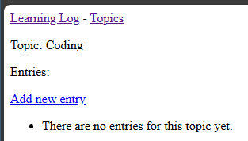

## Adding New Entries

Now that we can add Topics, we need to add Entries to those Topics.

---

### The New Entry ModelForm

Let's add another ModelForm for the `Entry` model.

In `learning_logs/forms.py`...

```python
-- SNIP --

from .models import Topic, Entry

-- SNIP --

class EntryForm(forms.ModelForm):
    """Form for the Entry model."""

    class Meta:
        """Metadata for the EntryForm."""
        model = Entry
        fields = ["text"]
        labels = {"text": ""}
        widgets = {"text": forms.Textarea(attrs={"cols": 80})}
```

A new item for us here is the `widgets` attribute in the `Meta` class.
This allows us to bring in controls other than a standard input box,
such as a text area (a scrolling text box).

---

### The New Entry URL

In `learning_logs/urls.py`...

```python
-- SNIP --

urlpatterns = [
    -- SNIP --

    # Page for adding a new Entry
    path("new_entry/<int:topic_id>/", views.new_entry, 
         name="new_entry"),
]
```

---

### The New Entry View

As always, we also need to add a new view.

In `learning_logs/views.py`...

```python
-- SNIP --
from .forms import TopicForm, EntryForm

-- SNIP --

def new_entry(request, topic_id):
    """Add a new entry for a particular topic."""
    # pylint: disable=no-member
    topic_item = Topic.objects.get(id=topic_id)

    if request.method != "POST":
        # No data submitted; create a blank form.
        form = EntryForm()
    else:
        # POST data submitted; process data.
        form = EntryForm(data=request.POST)
        if form.is_valid():
            new_entry_item = form.save(commit=False)
            new_entry_item.topic = topic_item
            new_entry_item.save()
            return redirect("learning_logs:topic", topic_id=topic_id)

    # Display a blank or invalid form.
    context = {"topic": topic_item, "form": form}
    return render(request, "learning_logs/new_entry.html", context)
```

---

### The New Entry Template

Lastly, we need to add a new template.

In `learning_logs/templates/learning_logs/new_entry.html`...

```html



<p>
    <a href="">{{ topic.text }}</a>
</p>

<p>Add a new entry:</p>
<form action="" method="post">
    
    {{ form.as_div }}
    <button name="submit">Add entry</button>
</form>

```

---

### Linking to the New Entry Form

We need to add a link to the new entry form in the `learning_logs/topic.html` template.

In `learning_logs/templates/learning_logs/topic.html`...

```html
-- SNIP --

<p>Entries:</p>
<p>
    <a href="">
        Add new entry
    </a>
</p>
<ul>

-- SNIP --
```

---

### Testing the New Entry Form

If we navigate to one of our topics, we will now see a link to add a 
new entry.



Cliking the link will display the new entry form.


I'll fill in mine with this coding entry.

> Integer Overflow:
> 
> In languages that implement fixed-size integers, it is important to 
> ensure that you will not overflow the maximum bit size; otherwise, 
> you may encounter unexpected behavior like accidentally flipping 
> the sign bit.

After clicking the "Add entry" button, we will be taken back to the
topic page where our new entry will be displayed.


---
