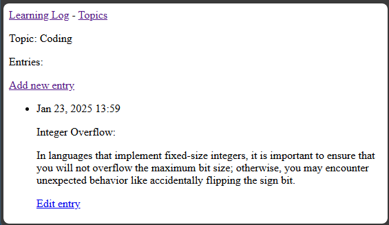
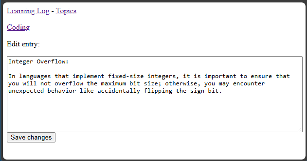
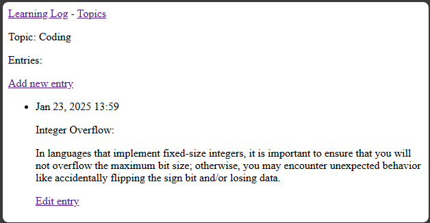

## Editing Entries

It is equally important for the user to be able to edit entries.

---

### The Edit Entry Form

We will be able to re-use the existing form from the previous lesson,
so it is not necessary to create a separate form for editing entries.

---

### The Edit Entry URL

We do need a separate URL pattern for the edit entry view.

In `learning_logs/urls.py`...

```python
-- SNIP --

urlpatterns = [
    -- SNIP --

    # Page for editing an entry
    path("edit_entry/<int:entry_id>/", views.edit_entry, 
         name="edit_entry"),
]
```

---

### The Edit Entry View

As always, we need to create a view for the edit entry URL.

In `learning_logs/views.py`...

```python
-- SNIP --

from .models import Topic, Entry

-- SNIP --

def edit_entry(request, entry_id):
    """Edit an existing entry."""
    # pylint: disable=no-member
    entry = Entry.objects.get(id=entry_id)
    topic_item = entry.topic
    if request.method != "POST":
        # Initial request; pre-fill form with the current entry.
        form = EntryForm(instance=entry)
    else:
        # POST data submitted; process data.
        form = EntryForm(instance=entry, data=request.POST)
        if form.is_valid():
            form.save()
            return redirect("learning_logs:topic", topic_id=topic_item.id)

    # Display a blank or invalid form.
    context = {"entry": entry, "topic": topic_item, "form": form}
    return render(request, "learning_logs/edit_entry.html", context)
```

---

### The Edit Entry Template

In `learning_logs/templates/learning_logs/edit_entry.html`...

```html



<p>
    <a href="">{{ topic }}</a>
</p>
<p>Edit entry:</p>
<form action="" method="post">
    
    {{ form.as_div }}
    <button name="submit">Save changes</button>
</form>

```

---

### Linking to Edit Entry

On the topic page, we need to modify the entries to link to the edit
entry page.

In `learning_logs/templates/learning_logs/topic.html`...

```html
-- SNIP --

    
    <li>
        -- SNIP --

        <p>
            <a href="">
                Edit entry
            </a>
        </p>
    </li>

-- SNIP --
```

---

### Testing the Edit Entry Page

Now, when we view a topic, we should be able to edit the entries.



Clicking the link will display the edit entry form.



After editing the entry text, clicking "Save changes" will update the entry.



---
