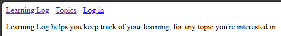
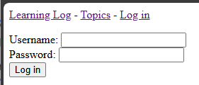
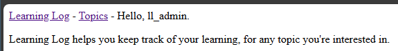

## User Accounts

At this point, the most significant missing piece of functionality is
the ability for a user to log in and edit their existing entries.

Django provides a built-in authentication system that can be used to
create and manage users.

Additionally, we'll need to modify the existing models to support
being matched to a specific user.

---

### Creating a User Accounts App

The `accounts` section of the portal will be another application. Just
like the `learning_logs` application, we'll use the command line to
create a new app called `accounts`:

```powershell
python manage.py startapp accounts
```

This will generate a new directory called `accounts` in the 
`learning_log` project directory.

> Note: Using the name `accounts` for this app will save time down the
> line, since Django assumes the name "accounts" as the default app
> name for its user authentication system.

---

### Registering the App

Of course, we need to register the app in the `settings.py` file.

In `settings.py`...

```python
-- SNIP --

INSTALLED_APPS = [
    # My Apps
    'learning_logs',
    'accounts',

    -- SNIP --
]
```

---

### Including the App URLs

Just like the `learning_logs` app, we need to include the `accounts`
URL file.

In the `ll_project/urls.py` file...

```python
-- SNIP --

urlpatterns = [
    path("admin/", admin.site.urls),
    path("accounts/", include("accounts.urls")),
    path("", include("learning_logs.urls")),
]
```

---

### The Accounts App URLs

Under `accounts/`, we'll create a new file called `urls.py`

In `accounts/urls.py`...

```python
"""URLs for the accounts app."""

from django.urls import path, include

app_name = "accounts"

urlpatterns = [
    # Include default auth urls.
    path("", include("django.contrib.auth.urls")),
]
```

Including the default authentication URLs from `django.contrib.auth`
will automatically generate URLs (and view functions) for logging in, 
logging out, and registering users.

---

### The Login Template

Because we're using the default authentication system, we'll need to
create a folder called `registration` under `accounts/templates/`.

In the `registration` folder, we'll create a file called `login.html`:

```html



    
        <p>Your username and password didn't match. Please try again.</p>
    

    <form method="post" action="">
        
        {{ form.as_div }}
        <button name="submit">Log in</button>
    </form>

```

---

### LOGIN_REDIRECT_URL

We need to let Django know where to redirect users after they log in.

At the end of `settings.py`...

```python
-- SNIP --

# My Settings
LOGIN_REDIRECT_URL = "learning_logs:index"
```

---

### Linking to the Login Page

We'll modify `base.html` to display a login link if the user is not 
already logged in.

In `base.html`...

```html
<p>
    <a href="">Learning Log</a>
    - 
    <a href="">Topics</a>
    - 
    
        Hello, {{ user.username }}.
    
        <a href="">Log in</a>
    
</p>


```

---

### Testing the Login

We can use our existing user (`ll_admin`) to validate this login
functionality.

From [http://localhost:8000](http://localhost:8000) or
[http://127.0.0.1:8000](http://127.0.0.1:8000) in your browser,
click on the "Log in" link.



You'll be presented with the login form.



After entering your credentials and clicking the "Log in" button, you
should be redirected to the learning log index page, which now shows
a greeting instead of the "Log in" link.



---
