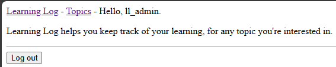
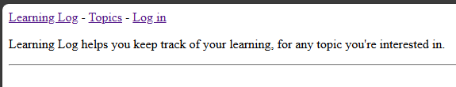

## User Logout

Django provides a built-in logout feature that can be used to log a
user out of the site.

---

### The Logout Form

We can add a logout form to the base template to log a user out of the
site and limit it to only be displayed if the user is logged in.

In `base.html`...

```html
-- SNIP --



<hr>

    <form action="" method="post">
        
        <button name="submit">Log out</button>
    </form>

```

---

### LOGOUT_REDIRECT_URL

Currently, if a user logs out, they will be redirected to the admin
page. We'll change that by updating the `settings.py` file...

```python
-- SNIP --

LOGOUT_REDIRECT_URL = "learning_logs:index"
```

---

### Testing Logout

While logged in, we will be presented with the logout button.



Clicking the logout button will log the user out and redirect them to
the home page.



---
