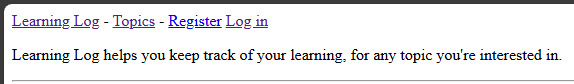
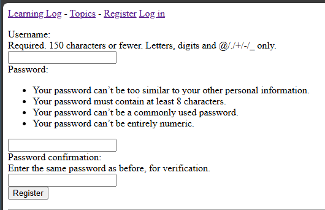
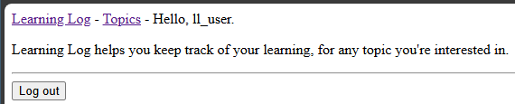

## User Registration

One important capability for a web portal is that a user must be able 
to create an account without relying on an administrator.

Django provides a built-in form for creating a user account.

While we'll use the default form for creating a user account, we'll
create our own view function and template for the registration page.

---

### The Registration URL

As usual, we'll add a URL pattern for the registration page.

In `accounts/urls.py`:

```python
-- SNIP --
from . import views

app_name = "accounts"

urlpatterns = [
    -- SNIP --

    # Registration page.
    path("register/", views.register, name="register"),
]
```

---

### The Registration View

In `accounts/views.py`:

```python
"""View functions for the accounts app."""

from django.shortcuts import render, redirect
from django.contrib.auth import login
from django.contrib.auth.forms import UserCreationForm

def register(request):
    """Register a new user."""
    if request.method != "POST":
        # Display blank registration form.
        form = UserCreationForm()
    else:
        # Process completed form.
        form = UserCreationForm(data=request.POST)

        if form.is_valid():
            new_user = form.save()
            # Log the user in and then redirect to home page.
            login(request, new_user)
            return redirect("learning_logs:index")

    # Display a blank or invalid form.
    context = {"form": form}
    return render(request, "registration/register.html", context)
```

---

### The Registration Template

In `accounts/templates/registration/register.html`:

```html



  <form action="" method="post">
    
    {{ form.as_div }}

    <button name="submit">Register</button>
  </form>

```

---

### Linking to the Registration Page

We'll add a link to the registration page from the base template.

In `learning_logs/templates/learning_logs/base.html`:

```html
-- SNIP --

    
        Hello, {{ user.username }}.
    
        <a href="">Register</a>
        <a href="">Log in</a>
    

-- SNIP --
```

---

### Testing the Registration Page

From [http://localhost:8000](http://localhost:8000) or
[http://127.0.0.1:8000](http://127.0.0.1:8000), click the link
to the registration page.



You should now see the user registration form.



Enter a username (I used `ll_user`) and a password, and then click
the "Register" button.

You should now be logged in as the new user and redirected to the 
home page.



---
