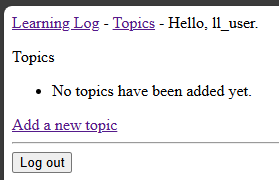
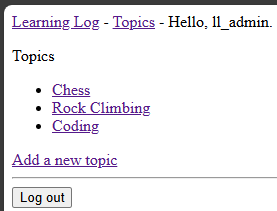

## User Data Ownership

A user should reasonably expect that other users cannot access their
data.

We'll update the project so that individual users own their data.

Note: We only need to modify the `Topic` model, since each `Entry`
already belongs to a `Topic`.

---

### Restricting Access to Logged-In Users

We can limit access to views by adding the `@login_required` decorator
to the view functions.

In `learning_logs/views.py`:

```python
-- SNIP --
from django.contrib.auth.decorators import login_required

-- SNIP --

@login_required
def topics(request):
    -- SNIP --
```

Since this will result in a redirect, we need to update `settings.py`
to set the `LOGIN_URL` to the login page.

In `learning_logs/settings.py`:

```python
-- SNIP --

LOGIN_URL = "accounts:login"
```

---

### Restricting Access to Logged-In Users (Part II)

You'll note that if you try to navigate to the Topics page while not
logged in, you'll be redirected to the login page.

However, you're able to cheat the system by typing the URL with a 
suffix like `/topics/1` in the address bar and access the page.

In order to fix this, we'll add the `@login_required` decorator to 
all of the view functions except `index()`.

In `learning_logs/views.py`:

```python
-- SNIP --

@login_required
def topics(request):
    -- SNIP --

@login_required
def topic(request, topic_id):
    -- SNIP --

@login_required
def new_topic(request):
    -- SNIP --

@login_required
def new_entry(request, topic_id):
    -- SNIP --

@login_required
def edit_entry(request, entry_id):
    -- SNIP --
```

---

### Tying Data to a Specific User

In the `Topic` model, we'll add a `owner` ForeignKey field to tie the
topic to a specific user.

In `learning_logs/models.py`:

```python
-- SNIP --

from django.contrib.auth.models import User

-- SNIP --

class Topic(models.Model):
    -- SNIP --

    owner = models.ForeignKey(User, on_delete=models.CASCADE)

-- SNIP --
```

---

### Updating Existing Data

We can review the users that have already been created in the
Django shell:

```powershell
python manage.py shell
...
>>> from django.contrib.auth.models import User
>>> User.objects.all()
<QuerySet [<User: ll_admin>, <User: ll_user>]>
>>> for user in User.objects.all():
...     print(user.username)
...
ll_admin
ll_user
```

---

### Migrating the Database

When we run the database migration command...

```powershell
python manage.py makemigrations learning_logs
```

... we will be prompted to choose the user to own the topics.

```
It is impossible to add a non-nullable field 'owner' to entry without specifying a default. This is because the database needs something to populate existing rows.
Please select a fix:
 1) Provide a one-off default now (will be set on all existing rows with a null value for this column)
 2) Quit and manually define a default value in models.py.
Select an option: 1
```

We'll select option 1, after which we'll be prompted for the default
user.

```
Please enter the default value as valid Python.
The datetime and django.utils.timezone modules are available, so it is possible to provide e.g. timezone.now as a value.
Type 'exit' to exit this prompt
>>> 1
```

We'll select `1`, which is the ID for `ll_admin`.

```
Migrations for 'learning_logs':
  learning_logs\migrations\0003_entry_owner.py
    + Add field owner to entry
```

And finally, now that the new migration is created, we can execute the
following:

```powershell
python manage.py migrate
```

Output:

```
Operations to perform:
  Apply all migrations: admin, auth, contenttypes, learning_logs, sessions
Running migrations:
  Applying learning_logs.0003_entry_owner... OK
```

---

### Verify Data Ownership

In another shell session, we can verify that the data is now owned by
the `ll_admin` user:

```powershell
python manage.py shell
...
>>> from learning_logs.models import Topic
>>> for topic in Topic.objects.all():
...     print(topic, topic.owner)
...
```

Output:

```
Chess ll_admin
Rock Climbing ll_admin
Coding ll_admin
```

---

### Restricting Topics Page Listing to Owners

So far, we've updated the model and database to identify an owner, but
we have not yet updated the views to only show topics owned by the
current user.

In `learning_logs/views.py`:

```python
-- SNIP --

@login_required
def topics(request):
    """Show all topics."""
    topic_list = Topic.objects.filter(owner=request.user) \
        .order_by("date_added")
    -- SNIP --
```

This will ensure that the user only sees the list of topics they own.

As `ll_user`...



As `ll_admin`...



---

### Restricting Topic Detail Page to Owners

Currently, a user can spoof the system and view the details of a topic
that is not owned by them by entering the URL manually.

To fix this, we can update the view to raise a 404 error if the topic
is not owned by the current user.

In `learning_logs/views.py`:

```python
-- SNIP --

from django.http import Http404

-- SNIP --

def topic(request, topic_id):
    -- SNIP --

    topic = Topic.objects.get(id=topic_id)
    if topic.owner != request.user:
        raise Http404
    -- SNIP --
```

---

### Restricting Entry Detail Page to Owners

We need to implement the same protection on the `edit_entry` view.

In `learning_logs/views.py`:

```python
-- SNIP --

def edit_entry(request, entry_id):
    -- SNIP --

    entry = Entry.objects.get(id=entry_id)
    topic_item = entry.topic
    if topic_item.owner != request.user:
        raise Http404
    -- SNIP --
```

---

### Tying a New Topic to a User

We need to update the `new_topic` view to assign the new topic to the
current user.

In `learning_logs/views.py`:

```python
-- SNIP --

def new_topic(request):
    -- SNIP --

        if form.is_valid():
            new_topic_item = form.save(commit=False)
            new_topic_item.owner = request.user
            new_topic_item.save()
            return redirect("learning_logs:topics")
    -- SNIP --
```

---

### Tying a New Entry to a Topic and User

ALthough the book does not cover this outside of the Try-it-Yourself
assignments, we need to update the `new_entry` view to prevent a 
non-owning user from adding an entry to a topic.

In `learning_logs/views.py`:

```python
-- SNIP --

def new_entry(request, topic_id):
    -- SNIP --

    topic_item = Topic.objects.get(id=topic_id)
    if topic_item.owner != request.user:
        raise Http404
    -- SNIP --
```

---
