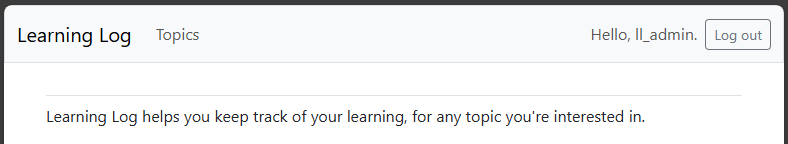

## Styling with Bootstrap

One of the most popular CSS frameworks is
[Bootstrap](https://getbootstrap.com/). It's a collection of HTML, 
CSS, and JavaScript files that can be used to create responsive, 
mobile-first websites.

---

### Using `django-bootstrap5`

Django's `django-bootstrap5` package makes it easy to use Bootstrap
in your Django app.

To install `django-bootstrap5`, run this command in the terminal:

```bash
python -m pip install django-bootstrap5
```

The register it to the `INSTALLED_APPS` list in your `settings.py`:

```python
-- SNIP --

INSTALLED_APPS = [
    # My Apps
    'learning_logs',
    'accounts',

    # Third Party Apps
    'django_bootstrap5',

    -- SNIP --
]
```

---

### Selecting a Bootstrap Template

Rather than configuring every item from scratch, you can use a 
pre-built Bootstrap theme.

You can find a list of available templates
[here](https://getbootstrap.com/docs/5.3/examples/).

The book has us use the *Navbar static* template.

---

### Adding Bootstrap to the Base Template

We'll completely rewrite the `base.html` template to use the Bootstrap
template we've selected as well as to conform to HTML5 standards.

In `learning_logs/templates/learning_logs/base.html`:

```html
<!DOCTYPE html>
<html lang="en">
<head>
    <meta charset="UTF-8">
    <meta name="viewport" content="width=device-width, initial-scale=1.0">
    <title>Learning Log</title>
    
    
    
</head>
<body>
    <!-- We will add content here -->
</body>
</html>
```

---

### Recreating the Base Template

This creates the conformant HTML5 file and implements Bootstrap, but 
we need to re-add our content sections to it.

In `learning_logs/templates/learning_logs/base.html`:

```html
-- SNIP --
<body>
    <nav class="navbar navbar-expand-md navbar-light bg-light mb-4 border">
        <div class="container-fluid">
            <a class="navbar-brand" href="">
                Learning Log
            </a>
            <button class="navbar-toggler" type="button" data-bs-toggle="collapse"
                   data-bs-target="#navbarCollapse" aria-controls="navbarCollapse"
                   aria-expanded="false" aria-label="Toggle navigation">
                <span class="navbar-toggler-icon"></span>
            </button>
            <div class="collapse navbar-collapse" id="navbarCollapse">
                <ul class="navbar-nav me-auto mb-2 mb-md-0">
                    <li class="nav-item">
                        <a class="nav-link" href="">
                            Topics
                        </a>
                    </li>
                </ul> <!-- End of links on left side of navbar -->
                <!-- We'll add account links here -->
            </div> <!-- Closes collapsible parts of navbar -->
        </div> <!-- Closes navbar container -->
    </nav> <!-- End of navbar -->

    

</body>
-- SNIP --
```

This adds the navigation bar to the base template.

---

### Adding Account Links

Now we need to add the account links to the base template.

In `learning_logs/templates/learning_logs/base.html`:

```html
-- SNIP --
                </ul> <!-- End of links on left side of navbar -->
                <!-- Account-related links -->
                <ul class="navbar-nav ms-auto mb-2 mb-md-0">
                    
                        <li class="nav-item">
                            <span class="navbar-text me-2">Hello, {{ user.username }}.</span>
                        </li>
                    
                        <li class="nav-item">
                            <a class="nav-link" href="">
                                Register
                            </a>
                        </li>
                        <li class="nav-item">
                            <a class="nav-link" href="">
                                Log in
                            </a>
                        </li>
                    
                </ul> <!-- End of account-related links -->
                <!-- We'll add the logout button here -->
-- SNIP --
```

---

### Adding Our Logout Button

We can now move the Logout form/button to the base template.

In `learning_logs/templates/learning_logs/base.html`:

```html
-- SNIP --
                </ul> <!-- End of account-related links -->
                
                <form action="" method="post">
                    
                    <button name="submit" class="btn btn-outline-secondary btn-sm">
                        Log out
                    </button>
                </form>
                
-- SNIP --
```

---

### Defining the Content Section of the Base Template

Now we can add content to the base template.

In `learning_logs/templates/learning_logs/base.html`:

```html
-- SNIP --
    </nav> <!-- End of navbar -->
    <main class="container">
        <div class="pb-2 mb-2 border-bottom">
            
        </div>
        <div>
            
        </div>
    </main>
</body>
-- SNIP --
```

---

### Validating the Base Template

When you open a browser and go to 
[http://localhost:8000](http://localhost:8000/) or 
[http://127.0.0.1:8000/](http://127.0.0.1:8000/), you will now see this:



---
