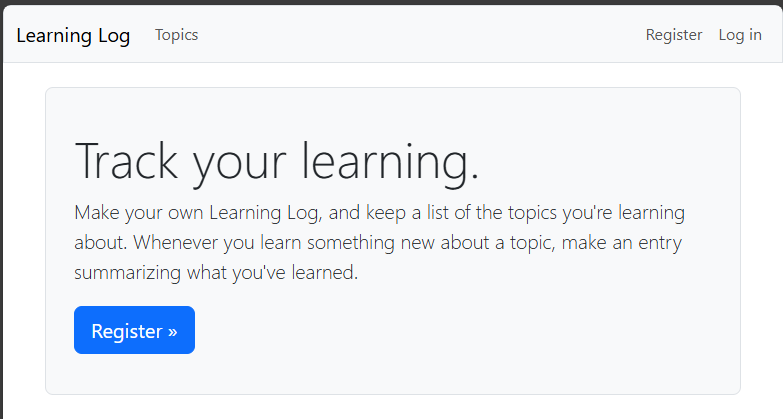

## Styling the Home Page

We'll modify the home page to make it more attractive.

### Adding a Jumbotron

Add a jumbotron to the home page, and add some text to the jumbotron.

In `learning_logs/templates/learning_logs/index.html`:

```html



    <div class="p-3 mb-4 bg-light border rounded-3">
        <div class="container-fluid py-4">
            <h1 class="display-3">Track your learning.</h1>
            <p class="lead">
                Make your own Learning Log, and keep a list of the 
                topics you're learning about. Whenever you learn something
                new about a topic, make an entry summarizing what you've
                learned.
            </p>
            <a class="btn btn-primary btn-lg mt-1" href="">
                Register &raquo;
            </a>
        </div>
    </div>

```

---

### Viewing the Home Page

Refreshing the home page will show the jumbotron.



---

### Next Up: Styling the Login Page
