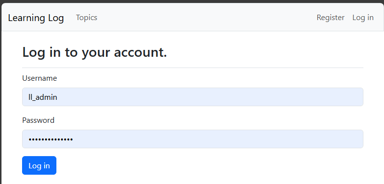

## Styling the Login Page

The login form is currently not well styled. Let's fix that.

---

### Implementing Bootstrap on the Login Form

In `login.html`...

```html




    <h2>Log in to your account.</h2>



    
        <p>Your username and password didn't match. Please try again.</p>
    

    <form method="post" action="">
        
        
        
    </form>

```

---

### Viewing the Styled Login Form

Now, if we visit the login page, we should see the styled form.



---
