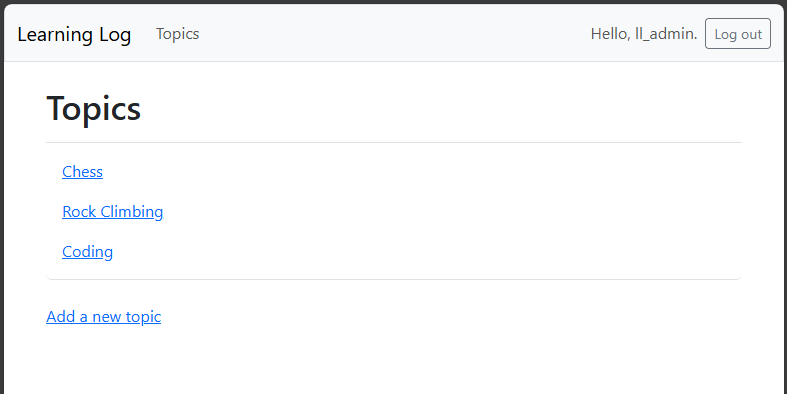

## Styling the Topics Page

The topics page is currently not well styled. Let's fix that.

---

### Implementing Bootstrap on the Topics Page

In `topics.html`...

```html



    <h1>Topics</h1>



<ul class="list-group border-bottom pb-2 mb-4">
    
    <li class="list-group-item border-0">
        <a href="">
            {{ topic.text }}
        </a>
    </li>
    
    <li class="list-group-item border-0">No topics have been added yet.</li>
    
</ul>

<a href="">Add a new topic</a>

```

---

### Viewing the Topics Page

Now, if we visit the topics page, we should see the Bootstrap styling.



---
