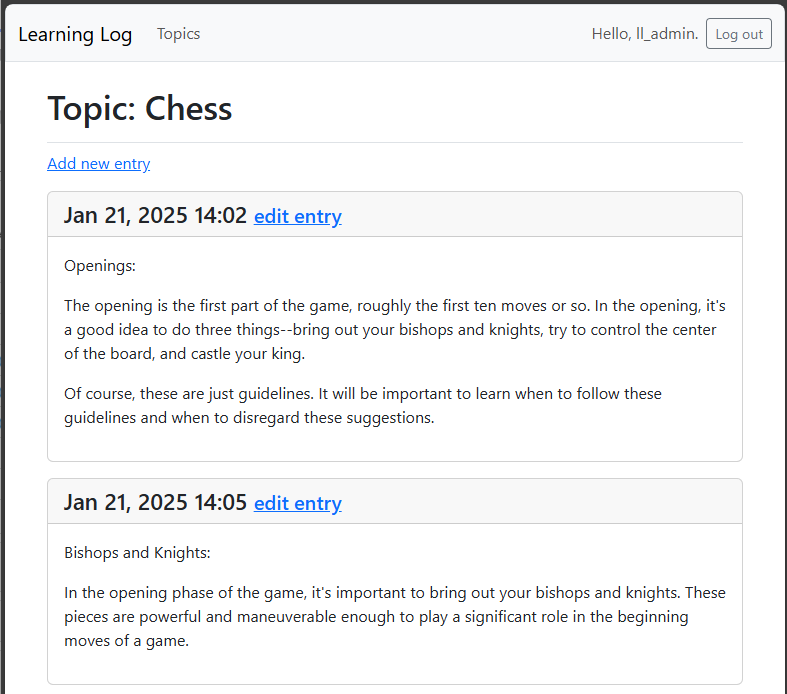

## Styling Entries on the Topic Page

The entries page is currently not well styled. Let's fix that.

---

### Implementing Bootstrap on the Entries Page

In `topic.html`...

```html



    <h1>Topic: {{ topic.text }}</h1>



<p>
    <a href="">
        Add new entry
    </a>
</p>

    <div class="card mb-3">
        <!-- Card header with timestamp and edit link -->
        <h4 class="card-header">
            {{ entry.date_added|date:'M d, Y H:i' }}
            <small>
                <a href="">
                    edit entry
                </a>
            </small>
        </h4>
        <!-- Card body with entry text -->
        <div class="card-body">
            {{ entry.text|linebreaks }}
        </div>
    </div>

    <li>There are no entries for this topic yet.</li>


```

---

### Viewing the Entries Page

Now, when we view a specific topic, the entries appear as Bootstrap cards.

>

---

### Styling the Remaining Forms Pages

There are still several forms that need styling. They are covered in the 
Try-it-Yourself section.

[Styling Other Forms](../Try%20it%20Yourself/01_other_forms.md)

---
