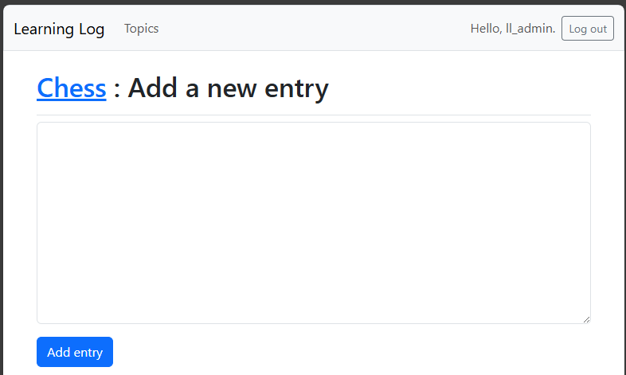
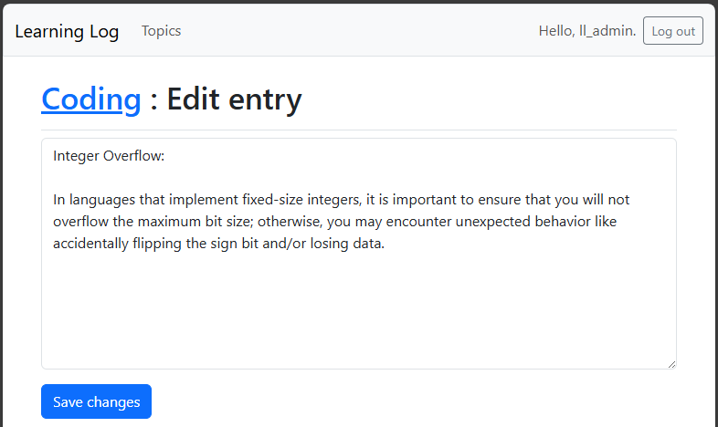
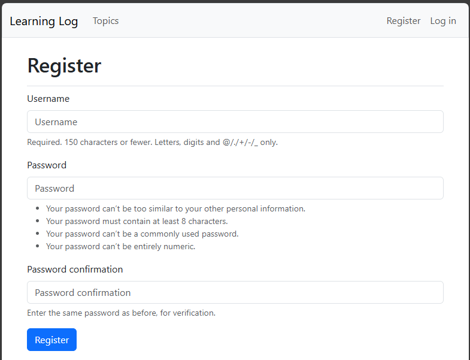

## Assignment 20.1: Other Forms

We applied Bootstrap's styles to the login page. Make similar changes to the
rest of the form-based pages including new_topic, new_entry, edit_entry, and
register.

---

### new_topic.html

```html




    <h1>Add a new topic</h1>



    <form method="post" action="">
        
        
        
    </form>

```


---

### new_entry.html

```html




    <h1>
        <a href="">{{ topic.text }}</a>
        : Add a new entry
    </h1>



    <form action="" method="post">
        
        
        
    </form>

```



---

### edit_entry.html

```html




    <h1>
        <a href="">{{ topic.text }}</a>
        : Edit entry
    </h1>



    <form action="" method="post">
        
        
        
    </form>

```



---

### register.html

```html




  <h1>Register</h1>



    <form action="" method="post">
        
        
        
    </form>

```



---
