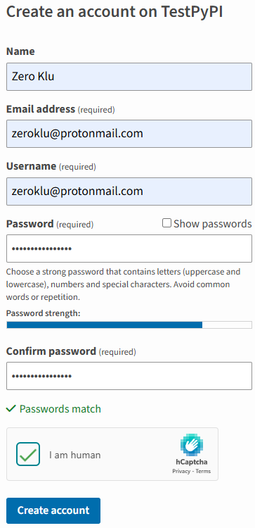
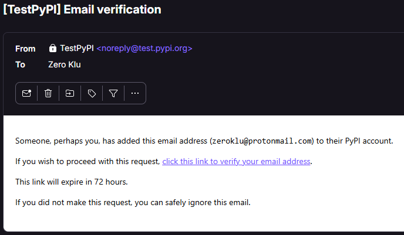

## Step 2: Create PyPI Credentials

You'll need a user account and an API key to publish modules to PyPI.

---

### 2.1: Create a PyPI Account

We'll be publishing to the [Test PyPI site](https://test.pypi.org), so
let's create an account there.

In a browser, navigate to [https://test.pypi.org/account/register/](https://test.pypi.org/account/register/)

The process to create a user account is quite straightforward (see below):

After you sign up, you'll receive an email to verify your account. Make
sure to do this before moving on to the next step.

---

### 2.2: Enable 2FA (Two-Factor Authentication)

You cannot create an API key until after you set up 2FA on the account.

Follow the on-screen instructions to enable two-factor authentication.

First, it will make you generate recovery codes. You'll have to use one
to enable the two-factor authentication, then you set it up using your
mobile phone and whichever authentication app you use.

---

### 2.3: Obtain an API Key

When you use the `twines` module to upload a package, you will use an API
key tied to your PyPI account as the password for every upload, so let's
generate one.

1. First, navigate your browser to
   [https://test.pypi.org/manage/account/#api-tokens](https://test.pypi.org/manage/account/#api-tokens)
2. Click on the [Add API Token] button
3. Name the token, and select the scope of "Entire account (all projects)"
4. Click on [Create Token]

Copy the token and save it somewhere safe! It will never be displayed 
again, so you must copt it right away.

In my projects, I save it in a file called tokens.txt and then add that
filename to my .gitignore file so it won't get added to source control
where others might read it.

---
