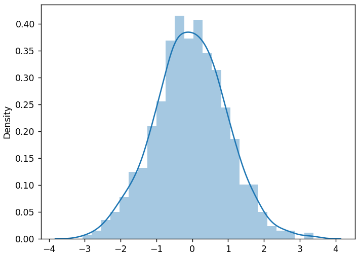
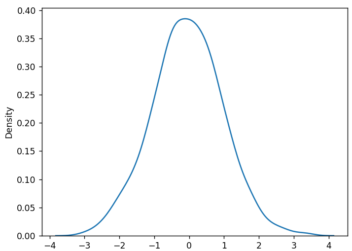
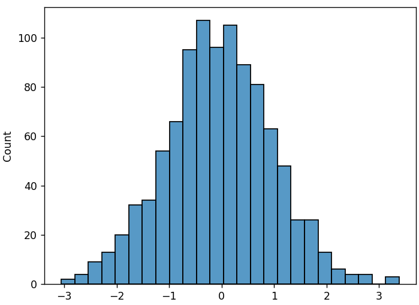
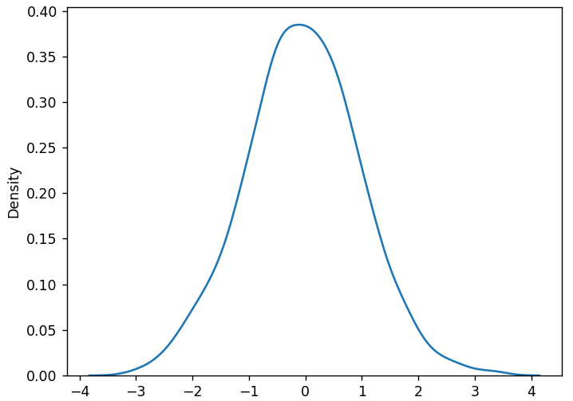
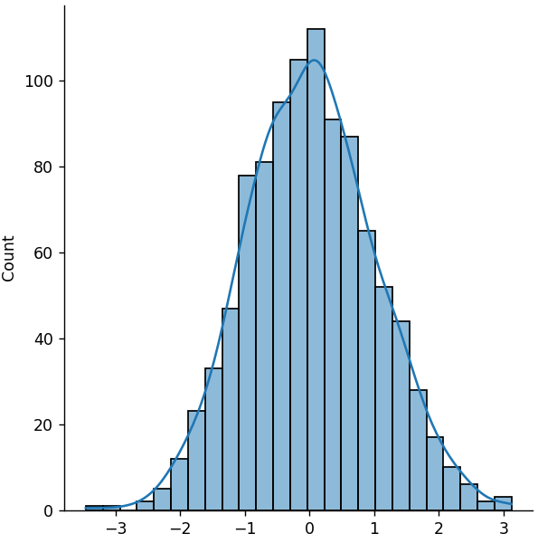

## Visualizing Distributions with Seaborn

Often it is easier to comprehend a random distribution via a graphical
visualization rather than the raw data.

There are many modules available for data visualization. One that is
relatively easy to us is Seaborn: a library built specifically for
statistical graphing.

We'll need to install the Seaborn library:

Making sure your virtual environment is active, run the following command:

```
python -m pip install seaborn
```

Note: Seaborn uses the Matplotlib PyPlot library to display graphs.

---

### Some Default Data

For all the examples below, I will use this code to generate the sample
data set.

```python
import numpy as np

data = np.random.normal(size=1000)
```

This uses a *normal* distribution (covered in the next lesson).

---

### Plotting Distributions

The tutorial I took this example from wants you to use Seaborn's
`distplot()` function. I will retain both examples using this function,
but it is important to understand that it is deprecated and will be 
removed in a later release of Seaborn.

---

#### Plotting Distribution with `distplot()`

Given the normal distribution we already generated, we will visualize the 
data with the `distplot()` function. This includes both:

1. A ***Histogram***:  
   A chart that plots the distribution of a numeric variable's values as 
   a series of bars.
2. A ***Kernel Density Estimation*** or ***KDE*** Curve:  
   A smooth, continuous plot representing the same data as shown in the
   histogram.

```python
import matplotlib.pyplot as plt
import seaborn as sns

sns.distplot(data)
plt.show()
```

This will display the following visualization:



However, in the terminal, you'll see this deprecation warning:

```
c:\...\04_seaborn.py:7: UserWarning: 

`distplot` is a deprecated function and will be removed in seaborn v0.14.
0.

Please adapt your code to use either `displot` (a figure-level function 
with similar flexibility) or 'histplot' (an axes-level function for 
histograms).

For a guide to updating your code to use the new functions, please see
https://gist.github.com/mwaskom/de44147ed2974457ad6372750bbe5751
```

We'll look at both replacement functions later in the lesson.

---

#### Plotting KDE Curve Only with `distplot()`

We can remove the histogram and plot only the KDE curve by adding the
`hist=False` argument.

```python
import matplotlib.pyplot as plt
import seaborn as sns

sns.distplot(data)
plt.show()
```

This will display the following visualization:



However, in the terminal, you'll see this deprecation warning:

```
c:\...\04_seaborn.py:12: UserWarning:

`distplot` is a deprecated function and will be removed in seaborn v0.14.
0.

Please adapt your code to use either `displot` (a figure-level function 
with similar flexibility) or `kdeplot` (an axes-level function for kernel 
density plots).

For a guide to updating your code to use the new functions, please see
https://gist.github.com/mwaskom/de44147ed2974457ad6372750bbe5751
```

We'll look at both replacement functions later in the lesson.

---

#### Plotting Histogram Only with `histplot()`

There are three primary replacements for the deprecated `distplot()` 
function.

The `histplot()` function displays only the histogram.

```python
import matplotlib.pyplot as plt
import seaborn as sns

sns.histplot(data)
plt.show()
```

This will display the following visualization:



---

#### Plotting KDE Curve Only with `kdeplot()`

The `kdeplot()` function plots just the KDE curve.

```python
import matplotlib.pyplot as plt
import seaborn as sns

sns.kdeplot(data)
plt.show()
```

This will display the following visualization:



---

#### Plotting Histogram and KDE Curve with `displot()`

The `displot()` function is the most flexible replacement. By default
it displays the histogram. However, with the `kde=True` argument, we
can create the original visualization we started from, with both the
histogram and the KDE curve.

```python
import matplotlib.pyplot as plt
import seaborn as sns

sns.displot(data, kde=True)
plt.show()
```

This will display the following visualization:



---

### Further Practice

In each of the following lessons, we will use this technique to display
a visualization of the distribution type we're working with.

---
