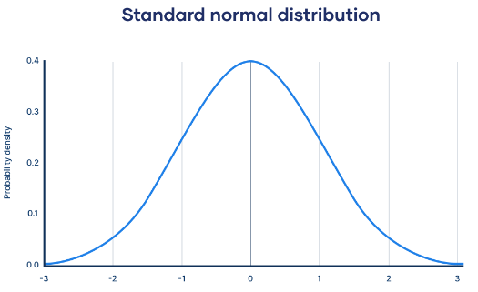
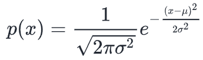
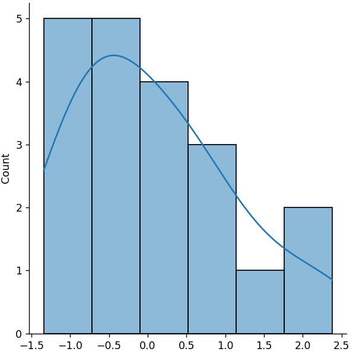
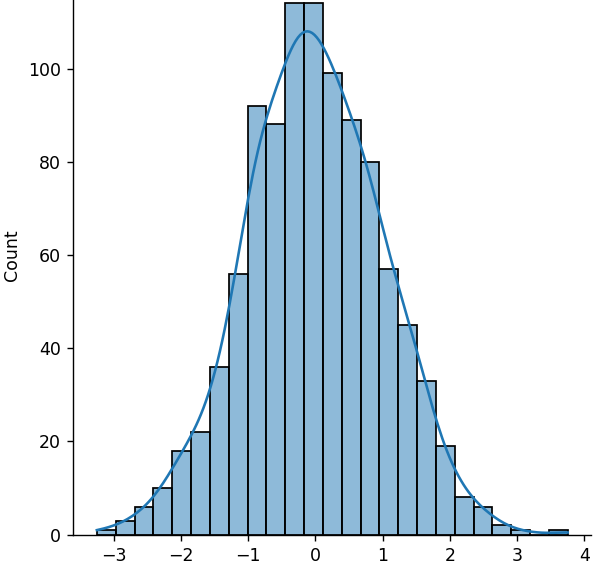
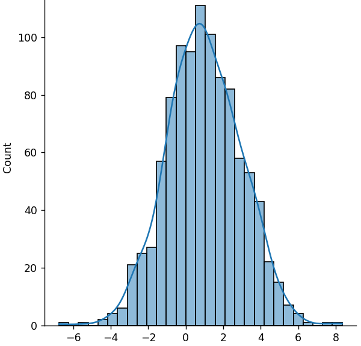

## The Normal Distribution

The *Normal Distribution*, also called the *Gaussian distribution* after
German mathematician Carl Friedrich Gauss, is the common distribution that
we think of as the *bell curve*.



The numbers across the bottom are *standard deviations* and the peak is the
arithmetic mean.

For the mathematically inclined, the formula for the normal distribution is



Where ***μ*** is the mean and ***σ*** is the standard deviation.

This curve, which peaks at the middle and tapers off at either end fits
the probability distributions of many common events. For example:

* IQ Scores
* Height
* Job Satisfaction
* Heartrates
* etc.

The `random.normal()` function will generate a normal distribution made up
of random values.

The function accepts the following parameters:

* `loc`: the arithmetic mean *μ*
* `scale`: the standard deviation *σ*
* `size`: the shape of the resulting array (`int` or `tuple`)

Almost all values in the distribution should fall between -3σ and 3σ.

When we generate a distribution, we should use a NumPy generator instance
rather than calling the function off of `random` itself. In the code
examples, I will use the `random.default_rng()` random number generator.

---

### A Small Sample

Let's generate a small distribution (20 members)

```python
from numpy import random
import matplotlib.pyplot as plt
import seaborn as sns

rng = random.default_rng()
arr = rng.normal(scale=1, size=20)
print(arr)
sns.displot(arr, kde=True)
plt.show()
```

Output:

```
[-0.87556535 -0.3744865  -0.61309055  0.62176215  0.4473115   1.23702118
 -1.15498777 -0.49993548 -0.31063961  0.6180979   2.38030173 -0.56564408
 -1.1873274   0.24095434  0.22992065 -0.75510367  1.91623044  1.13151411
 -0.07135201 -1.34054844]
```

Graph:



Note: Due to the small sample size, the approximation of the bell curve is
not very close.

---

### A Larger Sample

With a larger sample, we should see a better approximation of the bell
curve.

```python
from numpy import random
import matplotlib.pyplot as plt
import seaborn as sns

rng = random.default_rng()
arr = rnf.normal(size=1000)
sns.displot(arr, kde=True)
plt.show()
```

Graph:



---

### An Example with Specified Mean and Standard Deviation 

Let's look at an example where we specify the mean and standard deviation.

```python
from numpy import random
import matplotlib.pyplot as plt
import seaborn as sns

rng = random.default_rng()
arr = rng.normal(loc=1, scale=2, size=1000)
sns.displot(arr, kde=True)
plt.show()
```

Graph:



Note how the peak is near 1 instead of 0 as in the prior examples

---

### Multidimensional Normal Distributions

You can pass multidimensional shapes to the `size` argument, but although
the resulting graphs are quite pretty to look at, they require a deep
understanding of statistical analysis, so I have omitted them here.

There are a couple of examples in the [code file](./05_normal_dist.py), and
to execute them, you can just uncomment these function calls in `main()`

```python
def main() -> None:
    # -- SNIP --

    # normal_2d()
    # normal_2d_ms()
```

---
