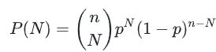
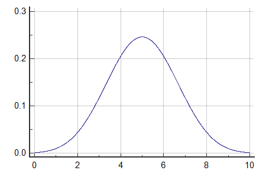
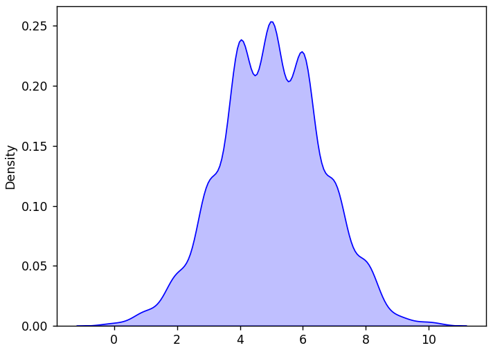
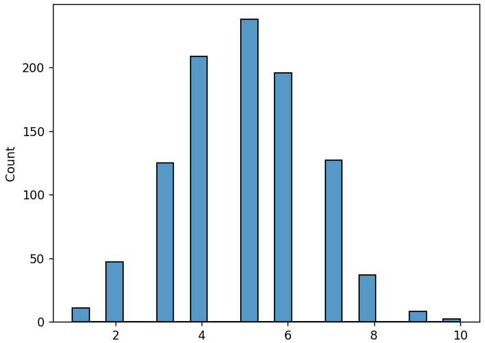
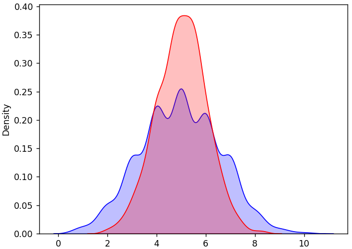

## The Binomial Distribution

A *binomial distribution*, as its name indicates, requires two values to 
compute: number of trials *n* and probability of desired outcome *p*.

It is useful for analyzing data with a known probability distribution, 
like:

* Flipping a coin
* Rolling a die
* etc.

The formula for the binomial distribution is:



A simple binomial distribution (say for a probability of ½) can look very
similar to a normal distribution, but it uses a very different formula.

Its graph looks like this:



NumPy's `random.binomial()` function takes three arguments:

`n`: number of trials
`p`: probability of desired outcome
`size`: shape of the resulting array (`int` or `tuple`)

---

### The Coin Flip

Let's look at the simple example of a coin flip. The probability of 
*heads* is 50%: `p = 0.5`. We'll flip the coin ten times: `n = 10`. And
we'll repeat the entire experiment 1000 times to get a distribution of the
number of successful outcomes.

---

#### Binomial Distribution - KDE Curve

First, we'll look at the KDE curve

```python
from numpy import random
import matplotlib.pyplot as plt
import seaborn as sns

bin = random.binomial(n=10, p=0.5, size=1000)
sns.kdeplot(bin, fill=True, color="blue")
plt.show()
```

Output:



One characteristic of a binomial distribution is that because all of the data is discrete, the KDE curve may have multiple peaks.

---

#### Binomial Distribution - Histogram

Next, we'll look at its histogram

```python
from numpy import random
import matplotlib.pyplot as plt
import seaborn as sns

bin = random.binomial(n=10, p=0.5, size=1000)
sns.histplot(bin)
plt.show()
```

Output:



One characteristic of a binomial distribution is that because all of the data is discrete, the KDE curve may have multiple peaks.

This graph more clearly shows the discrete nature of the values.

---

### Comparing Binomial and Normal Distributions

Let's take a look at a binomial distribution projected onto a normal
distribution centered on the same mean.

> Note: This is not a comparison on the same data, just a visual
> comparison to see the features of the distributions.

```python
from numpy import random
import matplotlib.pyplot as plt
import seaborn as sns

bin = random.binomial(n=10, p=0.5, size=1000)
norm = random.normal(loc=5, scale=1, size=1000)
sns.kdeplot(bin, fill=True, color="blue")
sns.kdeplot(norm, fill=True, color="red")
plt.show()
```

Output:



You can see how the normal distribution (red) is a more continuous curve 
across the possible values.

---
