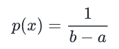
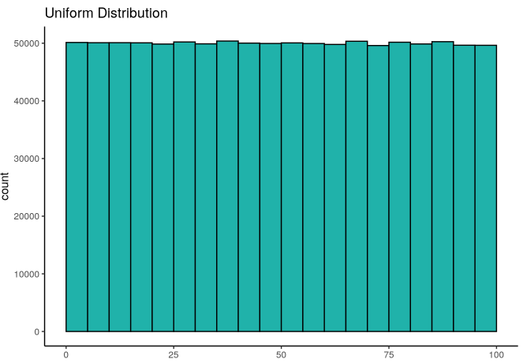
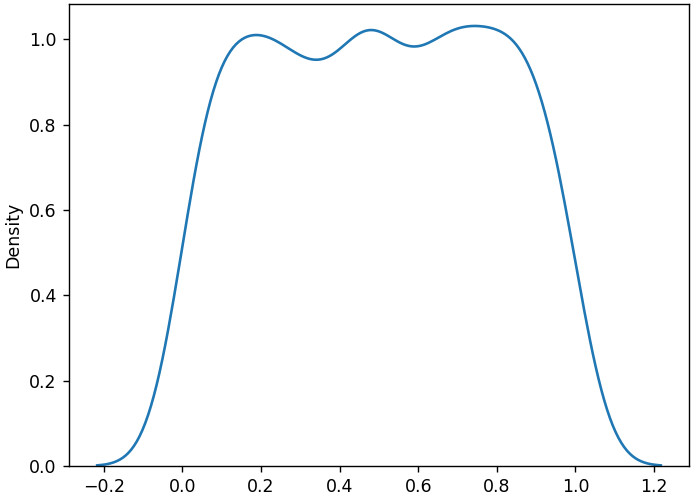
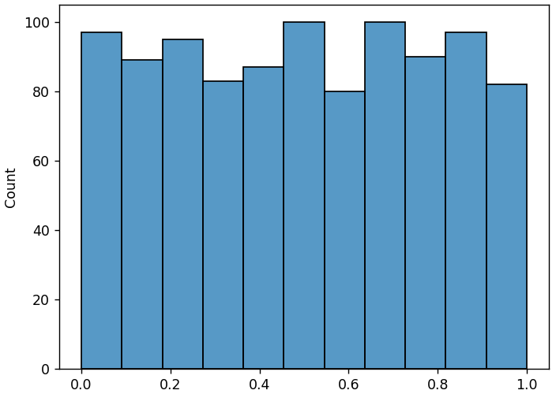
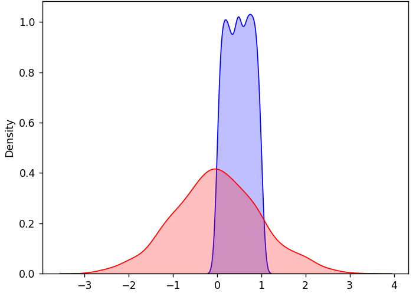

## Uniform Distribution

In a *Uniform Distribution*, any value within the range is equally likely 
to occur.

The formula for a uniform distribution is:



A graph of the distribution looks like this:



NumPy's `random.uniform()` function takes three arguments:

* `low`: Lower boundary of values
* `high`: Upper boundary of values
* `size`: Shape of the output array

When we generate a distribution, we should use a NumPy generator instance
rather than calling the function off of `random` itself. In the code
examples, I will use the `random.default_rng()` random number generator.

---

### An Example with 1000 Values

Here, we'll look at a uniform distribution from 0 to 1, with 1000 values.

#### KDE Curve

Let's visualize the KDE curve first.

```python
from numpy import random
import matplotlib.pyplot as plt
import seaborn as sns

rng = random.default_rng()
uni = rng.uniform(size=1000)
sns.kdeplot(uni)
plt.show()
```

Output:



It's no surprise that the curve immediately leaps to a nearly flat peak
at zero and remains there util the upper limit of one.

---

#### Histogram

Now, let's visualize the histogram.

```python
from numpy import random
import matplotlib.pyplot as plt
import seaborn as sns

rng = random.default_rng()
uni = rng.uniform(size=1000)
sns.histplot(uni)
plt.show()
```

Output:



We can see the uniformity even better in the histogram.

Although there is some variance (we're using random data and 1000 is a
relatively small sample size), the distribution is mostly flat, with all
possible values showing similar frequency.

---

### Comparing Uniform and Normal Distributions

Here is an example showing a Uniform distribution and a normal 
distribution.

> Note: These are not comparing the same data. The idea is to visually
> understand how a Uniform plot compares to a normal distribution plot.

```python
from numpy import random
import matplotlib.pyplot as plt
import seaborn as sns

rng = random.default_rng()
uni = rng.uniform(size=1000)
norm = rng.normal(size=1000)
sns.kdeplot(uni, fill=True, color="blue", label="Uniform")
sns.kdeplot(norm, fill=True, color="red", label="Normal")
plt.show()
```

Output:



---
