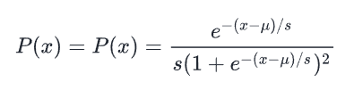
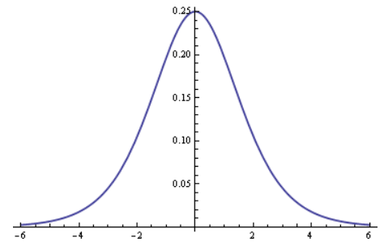
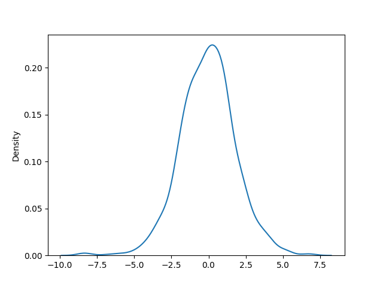
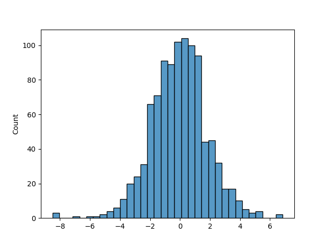
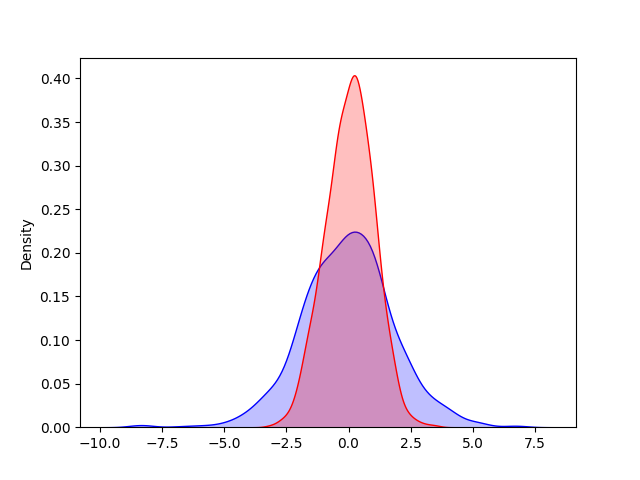

## Logistic Distribution

A *Logistic Distribution* is very similar in appearance to a normal 
distribution in that it takes the form of a symmetric curve that peaks at 
the mean.

However in the logistic distribution, the tails are heavier and wider, and
the peak is lower, which makes it useful for certain large data problems
where it is more consistent with the data at extreme values.

The formula for the logistic distribution is:



A graph of a logistic distribution looks like this:



The NumPy `random.logistic()` function accepts the same three arguments
as `normal()`:

* `loc`: the arithmetic mean *μ*
* `scale`: the standard deviation *s*
* `size`: the shape of the resulting array (`int` or `tuple`)

Almost all values in the distribution should fall between -3σ and 3σ.

When we generate a distribution, we should use a NumPy generator instance
rather than calling the function off of `random` itself. In the code
examples, I will use the `random.default_rng()` random number generator.

---

### Sample Logistic Distribution

Let's generate a 1000-item logistic distribution.

#### Logistic Distribution KDE Curve

Let's review the KDE curve for our distribution.

```python
from numpy import random
import matplotlib.pyplot as plt
import seaborn as sns

rng = random.default_rng()
log = rng.logistic(size=1000)
sns.kdeplot(log)
plt.show()
```

Output:



---

#### Logistic Distribution Histogram

Let's review the histogram for our distribution.

```python
from numpy import random
import matplotlib.pyplot as plt
import seaborn as sns

rng = random.default_rng()
log = rng.logistic(size=1000)
sns.histplot(log)
plt.show()
```

Output:



Note how the tails extend wider (don't collapse to zero as soon).

---

### Comparing Logistic and Normal Distributions

Here is an example showing a logistic distribution and a normal 
distribution.

> Note: These are not comparing the same data. The idea is to visually
> understand how a logistic plot compares to a normal distribution plot.

```python
from numpy import random
import matplotlib.pyplot as plt
import seaborn as sns

rng = random.default_rng()
log = rng.logistic(size=1000)
norm = rng.normal(size=1000)
sns.kdeplot(log, fill=True, color="blue", label="Logistic")
sns.kdeplot(norm, fill=True, color="red", label="Normal")
plt.show()
```

Output:



Note how the tails extend wider (don't collapse to zero as soon).

---
