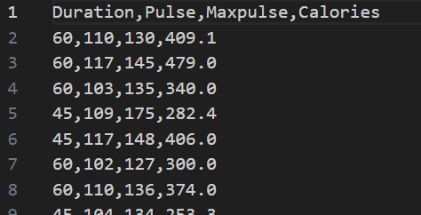
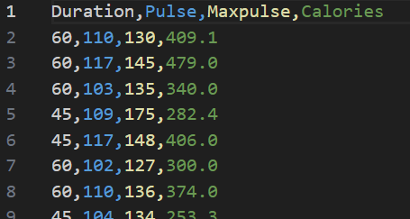

## Pandas

Sadly, this is not a lesson on adorable bamboo-eating beasties.

---

### What is Pandas?

Pandas is a Python library used for working with data sets and includes
functions for:

* Data Analysis
* Data Cleaning (Standardization)
* Data Exploration
* Data Manipulation

Pandas provides the ability to work with large data sets and draw 
conclusions based on statistical theories.

Through data cleaning, Pandas can make messy data readable and relevant.
Data relevance is a critical factor in data science and AI.

---

### What Can Pandas Do?

Given a data set, Pandas can:

* Provide answers to various questions about the data, such as:
    * Is there a correlation among multiple columns?
    * What are the average, min, and max values?
* Remove rows that contain:
    * Irrelevant data
    * Invalid or wrong data
        * NULL
        * Empty
        * Out of bounds

---

### Installation

Depending on what modules you have already installed, you may already have
Pandas on your system. However, if you need to install it, with your
virtual environment activated, run the following command:

```
python -m pip install pandas
```

---

### Extensions

Because we'll be working with CSV data files, I recommend installing the
[Rainbow CSV](https://marketplace.visualstudio.com/items?itemName=mechatroner.rainbow-csv)
VS Code extension to make CSV files much easier to read

|||
|-|-|
|Without Rainbow CSV|With Rainbow CSV|
|||

---

### Validate Version

We need to be sure we're running at least version 2.0 of Pandas, which we 
can easily do with this line of code:

```python
import pandas as pd

print(f"Running Pandas version: {pd.__version__}")
```

Output:

```
Running Pandas version: 2.2.2
```

---
