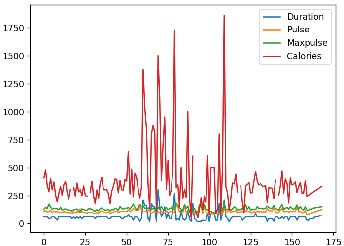
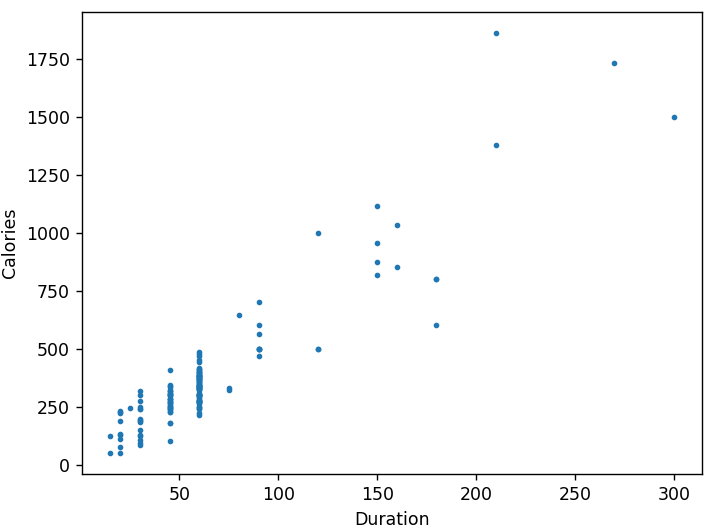
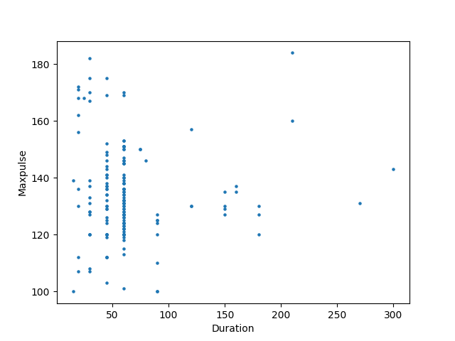
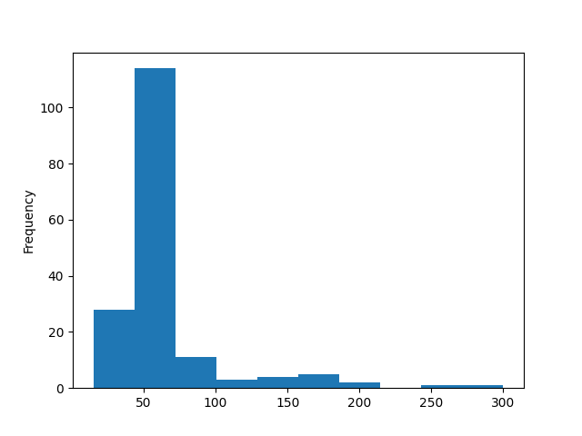

## Correlating and Plotting Data

We could spend a long time reviewing the many ways we could perform
statistical analysis on data sets, but for now, we'll look at two items:

* Correlation
* Plotting Data

For this example, we'll work with a file containing only numeric data:
[data.csv](./data/data.csv)

We'll assume the following code has already been run to load the data:

```python
import pandas as pd

df = pd.read_csv("./data/data.csv")
```

---

### Correlation

Correlation analysis examines data to see if there is a relationship
between columns in the data set.

For example, if you have data plotting quantity of a product used per month and monthly costs, you would expect to see a high correlation between
those two items.

Pandas exposes the `corr()` function to calculate the correlations in a
`DataFrame`. This will return a matrix in which each column is compared
will all other columns and a relationship score is provided.

Relationship scores range from -1 to 1, where the farther a score is from 
zero, the higher the correlation. Negative values imply an inverse
correlation.

We'll ignore the fact that there are some places where data is missing or
aberrant and allow the `corr()` function to handle data inconsistencies for
us.

```python
corr_matrix = df.corr()
print("Correlations:")
print(corr_matrix)
```

Output:

```
Correlations:
          Duration     Pulse  Maxpulse  Calories
Duration  1.000000 -0.155408  0.009403  0.922717
Pulse    -0.155408  1.000000  0.786535  0.025121
Maxpulse  0.009403  0.786535  1.000000  0.203813
Calories  0.922717  0.025121  0.203813  1.000000
```

Obviously, each column is a perfect 1.0 correlation to itself, but we can 
see some other high correlations:

* `Duration` and `Calories` have a 0.92 correlation, which suggests that 
  the longer you work out, the more calories you burn.
* `Pulse` and `Maxpulse` also have a relatively high correlation of 0.79

On the other hand, neither `Pulse` nor `Maxpulse` has a meaningful 
correlation to `Duration` or `Calories`.

---

### Plotting Data

It's useful to provide a graph along with data analysis. Pandas exposes the
`plot()` method to generate a plot compatible with the `matplotlib.pyplot`
module.

You already almost certainly have this module installed, but if not, you
can use this command to install it:

```
python -m pip install matplotlib
```

#### Plotting all Numeric Data

We can call the `plot()` method with no arguments to plot all the columns 
at once.

```python
df.plot()
plt.show()
```

Output:



----

#### Plotting Specific Columns

We can also plot a graph comparing one column to another.

Here, we can see the high correlation between `Duration` and `Calories`

```python
df.plot.scatter(x="Duration", y="Calories")
plt.show()
```

Output:



---

... or the low correlation between `Duration` and `Maxpulse`

```python
df.plot.scatter(x="Duration", y="Maxpulse")
plt.show()
```



---

#### Plotting a Histogram

If we're only interested in one datum (`Duration` for example), a histogram
plot may be the best choice:

```python
  df["Duration"].plot.hist()
  plt.show()
```

Output:



---
