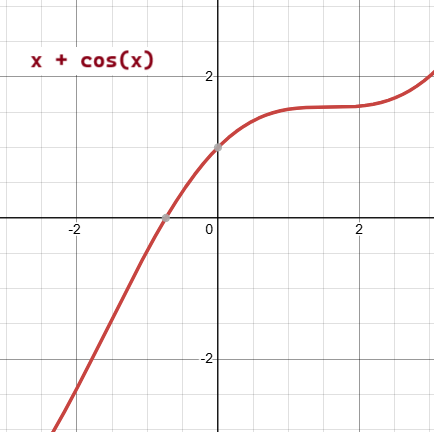
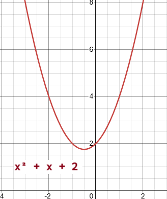

## SciPy Optimizers

Optimizers are a set of procedures defined in SciPy that either find the
minimum value of a function, or the root of an equation.

Essentially, any algorithm in Machine Learning is nothing more than a 
complex equation that needs to be minimized with the help of given data.

---

### Roots of Equations

NumPy is capable of finding roots for polynomials and linear equations, but
but it can not find roots for non linear equations, like this one: 
`x + cos(x)`

For that you can use SciPy's `optimize.root()` function.

The function takes two required arguments:

* `fun`: a function representing an equation
* `x0`: an initial guess for the root

The `root()` function returns a an object containing details about the
root computation, but the important part is that the result object's `x`
property contains an array of the computed root values.

We can implement a simple function for x + cos(x):

```python
from math import cos
from numpy import ndarray

def x_plus_cos_x(x: int|float|ndarray[int|float]) -> int|float:
    """Compute x plus cos(x)"""
    if isinstance(x, ndarray): x = x[0]
    return x + cos(x)
```

> Note: The `root()` function actually passes a NumPy `ndarray` object, not
> a scalar, to the function passed to its `fun` argument.
>
> If we don't extract the scalar value before computation, we'll receive
> this warning
> 
> ```
> DeprecationWarning: Conversion of an array with ndim > 0 to a scalar is
> deprecated, and will error in future. Ensure you extract a single
> element from your array before performing this operation. 
> (Deprecated NumPy 1.25.)
>   return x + cos(x)
> ```

Then, we can call the `root()` method to compute the root of our function:

```python
from scipy.optimize import root

r = root(x_plus_cos_x, 0)
print(f"root of x + cos(x) = {r.x[0]:.2f}")
```

Output:

```
root of x + cos(x) = -0.74
```

We can see that this result matches the expected root for `x + cos(x)`



---

### Minimizing a Function

A function, in this context, represents a curve, curves have high points 
and low points.

* High points are called maxima
    * The highest point in the whole curve is called global maxima
    * Others are called local maxima
* Low points are called minima
    * The lowest point in the whole curve is called global minima
    * Others are called local minima

#### Finding Minima

The math for solving unconstrained nonlinear optimization problems is hard.
I mean **really hard**. We would not want to have to work out the code to
solve these ourselves.

Using the SciPy `minimize()` function, we can find the minimum point for a
curve.

The function takes the following arguments:

* `fun`: Function representing an equation
* `x0`: Initial guess for minimum of the curve
* `method`: Name of the solver method to use. There are many available
  solver algorithms including:
    * `CG`
    * `BFGS`
    * `Newton-CG`
    * `L-BFGS-B`
    * `TNC`
    * `COBYLA`
    * `SLSQP`
* `callback`: Function to call after each iteration of optimization
* `options`: Dictionary defining extra parameters
    * `disp`: Boolean (print detailed description)
    * `gtol`: Number (error tolerance)

Let's consider the equation `x² + x + 2`

First, we create a function that computes the equation:

```python
def x_squared_plus_x_plus_2(x: int|float|ndarray[int|float]) -> int|float:
    """Compute x² + x + 2"""
    return x ** 2 + x + 2
```

Then we can call the `minimize()` function.

We'll use the Broyden–Fletcher–Goldfarb–Shanno algorithm
([BFGS](https://en.wikipedia.org/wiki/Broyden%E2%80%93Fletcher%E2%80%93Goldfarb%E2%80%93Shanno_algorithm)) 

```python
m = minimize(x_squared_plus_x_plus_2, 0, method="BFGS")
print(f"minimum of x² + x + 2 = {m.x[0]:.2f}")
```

Output:

```
minimum of x² + x + 2 = -0.50
```

This matches the expected minima for the equation:



---
